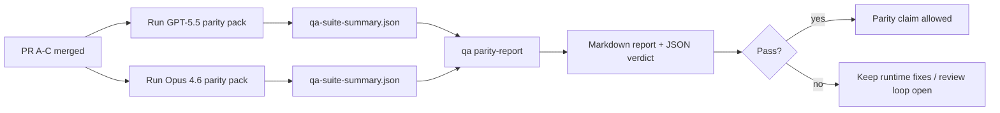

---
read_when:
    - 審查 GPT-5.5 / Codex 對等性 PR 系列
    - 維護支撐同等性計畫的六項契約代理式架構
summary: 如何將 GPT-5.5 / Codex 同等性計畫作為四個合併單元進行審查
title: GPT-5.5 / Codex 對等性維護者備註
x-i18n:
    generated_at: "2026-05-06T09:11:25Z"
    model: gpt-5.5
    provider: openai
    source_hash: 5752b4610f8b0d70b80d880ea10df75478b5f85ca431cdb73d3b61d745b23356
    source_path: help/gpt55-codex-agentic-parity-maintainers.md
    workflow: 16
---

此說明解釋如何將 GPT-5.5 / Codex 對等性計畫視為四個合併單元來審查，同時不丟失原本的六項合約架構。

## 合併單元

### PR A：嚴格 agentic 執行

負責：

- `executionContract`
- GPT-5 優先的同一輪後續執行
- `update_plan` 作為非終止性的進度追蹤
- 使用明確的受阻狀態，而非只有計畫後默默停止

不負責：

- 驗證/執行階段失敗分類
- 權限真實性
- 重播/延續重新設計
- 對等性基準測試

### PR B：執行階段真實性

負責：

- Codex OAuth 範圍正確性
- 型別化的供應者/執行階段失敗分類
- 如實呈現 `/elevated full` 可用性與受阻原因

不負責：

- 工具結構描述正規化
- 重播/存活狀態
- 基準測試閘門

### PR C：執行正確性

負責：

- 供應者擁有的 OpenAI/Codex 工具相容性
- 無參數的嚴格結構描述處理
- 重播無效狀態呈現
- 已暫停、已受阻與已放棄的長任務狀態可見性

不負責：

- 自行選擇的延續
- 供應者掛鉤之外的通用 Codex 方言行為
- 基準測試閘門

### PR D：對等性框架

負責：

- 第一波 GPT-5.5 與 Opus 4.6 情境套件
- 對等性文件
- 對等性報告與發行閘門機制

不負責：

- QA-lab 之外的執行階段行為變更
- 框架內的驗證/代理/DNS 模擬

## 對應回原本的六項合約

| 原始合約                                 | 合併單元 |
| ---------------------------------------- | -------- |
| 供應者傳輸/驗證正確性                    | PR B     |
| 工具合約/結構描述相容性                  | PR C     |
| 同一輪執行                               | PR A     |
| 權限真實性                               | PR B     |
| 重播/延續/存活正確性                     | PR C     |
| 基準測試/發行閘門                        | PR D     |

## 審查順序

1. PR A
2. PR B
3. PR C
4. PR D

PR D 是證明層。它不應成為延遲執行階段正確性 PR 的理由。

## 審查重點

### PR A

- GPT-5 執行會採取行動或安全失敗，而不是停在評論
- `update_plan` 不再看起來本身就是進度
- 行為維持 GPT-5 優先，且範圍限於嵌入式 Pi

### PR B

- 驗證/代理/執行階段失敗不再坍縮成通用的「模型失敗」處理
- 只有在實際可用時才將 `/elevated full` 描述為可用
- 模型與面向使用者的執行階段都能看見受阻原因

### PR C

- 嚴格的 OpenAI/Codex 工具註冊行為可預期
- 無參數工具不會在嚴格結構描述檢查中失敗
- 重播與 Compaction 結果會保留真實的存活狀態

### PR D

- 情境套件易於理解且可重現
- 套件包含會變更狀態的重播安全性路徑，而不只是唯讀流程
- 報告可供人類與自動化讀取
- 對等性聲明有證據支持，而非軼聞式說法

PR D 的預期產物：

- 每次模型執行的 `qa-suite-report.md` / `qa-suite-summary.json`
- 含彙總與情境層級比較的 `qa-agentic-parity-report.md`
- 含機器可讀判定的 `qa-agentic-parity-summary.json`

## 發行閘門

在符合以下條件前，不要聲稱 GPT-5.5 與 Opus 4.6 對等或優於 Opus 4.6：

- PR A、PR B 和 PR C 已合併
- PR D 乾淨地跑完第一波對等性套件
- 執行階段真實性回歸套件維持綠燈
- 對等性報告顯示沒有假成功案例，且停止行為沒有回歸

對等性框架不是唯一的證據來源。審查時請明確保留此分工：

- PR D 負責以情境為基礎的 GPT-5.5 與 Opus 4.6 比較
- PR B 的決定性套件仍負責驗證/代理/DNS 與完整存取真實性的證據

## 快速維護者合併工作流程

當你準備落地某個對等性 PR，並想要可重複、低風險的流程時，請使用此流程。

1. 合併前確認已達到證據門檻：
   - 可重現的症狀或失敗測試
   - 已在受影響程式碼中驗證根本原因
   - 修正位於相關路徑
   - 回歸測試或明確的手動驗證說明
2. 合併前進行分流/標籤：
   - 當 PR 不應落地時，套用任何 `r:*` 自動關閉標籤
   - 讓合併候選項目沒有未解決的阻擋討論串
3. 在受影響表面本機驗證：
   - `pnpm check:changed`
   - 當測試有變更或錯誤修正信心取決於測試覆蓋率時，執行 `pnpm test:changed`
4. 使用標準維護者流程落地（`/landpr` 流程），然後驗證：
   - 連結議題的自動關閉行為
   - `main` 上的 CI 與合併後狀態
5. 落地後，針對相關開啟中的 PR/議題執行重複搜尋，並且只用正式參照關閉。

如果缺少任何一項證據門檻項目，請要求變更而不是合併。

## 目標到證據對照表

| 完成閘門項目                             | 主要擁有者  | 審查產物                                                            |
| ---------------------------------------- | ----------- | ------------------------------------------------------------------- |
| 沒有只有計畫的停滯                       | PR A        | 嚴格 agentic 執行階段測試與 `approval-turn-tool-followthrough`      |
| 沒有假進度或假工具完成                   | PR A + PR D | 對等性假成功計數加上情境層級報告細節                                |
| 沒有錯誤的 `/elevated full` 指引         | PR B        | 決定性的執行階段真實性套件                                          |
| 重播/存活失敗維持明確                    | PR C + PR D | 生命週期/重播套件加上 `compaction-retry-mutating-tool`              |
| GPT-5.5 符合或超越 Opus 4.6              | PR D        | `qa-agentic-parity-report.md` 與 `qa-agentic-parity-summary.json`   |

## 審查者速記：之前與之後

| 之前的使用者可見問題                                      | 之後的審查訊號                                                                        |
| --------------------------------------------------------- | ------------------------------------------------------------------------------------- |
| GPT-5.5 在規劃後停止                                      | PR A 顯示採取行動或受阻的行為，而不是只有評論即完成                                  |
| 使用嚴格 OpenAI/Codex 結構描述時，工具使用感覺脆弱        | PR C 讓工具註冊與無參數呼叫維持可預期                                                |
| `/elevated full` 提示有時具誤導性                         | PR B 將指引連結到實際執行階段能力與受阻原因                                          |
| 長任務可能消失在重播/Compaction 的模糊狀態中              | PR C 發出明確的已暫停、已受阻、已放棄與重播無效狀態                                  |
| 對等性聲明是軼聞式的                                      | PR D 產出報告加上 JSON 判定，並在兩個模型上使用相同的情境覆蓋                         |

## 相關

- [GPT-5.5 / Codex agentic 對等性](/zh-TW/help/gpt55-codex-agentic-parity)
