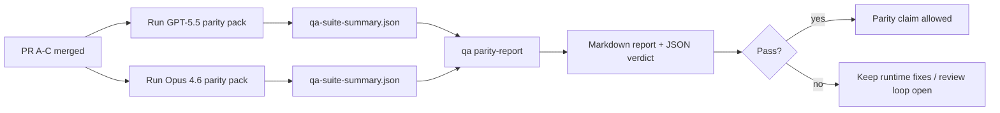

---
read_when:
    - 審查 GPT-5.5 / Codex 功能對等拉取請求系列
    - 維護同等性計畫背後的六契約代理式架構
summary: 如何以四個合併單元審閱 GPT-5.5 / Codex 功能對等計畫
title: GPT-5.5 / Codex 一致性維護者注意事項
x-i18n:
    generated_at: "2026-04-30T03:11:34Z"
    model: gpt-5.5
    provider: openai
    source_hash: 8de69081f5985954b88583880c36388dc47116c3351c15d135b8ab3a660058e3
    source_path: help/gpt55-codex-agentic-parity-maintainers.md
    workflow: 16
---

這則註記說明如何將 GPT-5.5 / Codex 對等性計畫作為四個合併單元來審查，同時不丟失原本的六項契約架構。

## 合併單元

### PR A：嚴格代理式執行

負責：

- `executionContract`
- GPT-5 優先的同回合後續執行
- 將 `update_plan` 作為非終止性的進度追蹤
- 使用明確的 blocked 狀態，而不是只規劃後無聲停止

不負責：

- auth/runtime 失敗分類
- 權限真實性
- replay/continuation 重新設計
- 對等性基準測試

### PR B：執行階段真實性

負責：

- Codex OAuth 範圍正確性
- 型別化的 provider/runtime 失敗分類
- 真實的 `/elevated full` 可用性與 blocked 原因

不負責：

- 工具 schema 正規化
- replay/liveness 狀態
- 基準測試閘門

### PR C：執行正確性

負責：

- provider 擁有的 OpenAI/Codex 工具相容性
- 無參數嚴格 schema 處理
- replay-invalid 顯示
- paused、blocked，以及 abandoned 長任務狀態可見性

不負責：

- 自行選擇的 continuation
- provider hooks 之外的通用 Codex dialect 行為
- 基準測試閘門

### PR D：對等性測試框架

負責：

- 第一波 GPT-5.5 與 Opus 4.6 情境包
- 對等性文件
- 對等性報告與發布閘門機制

不負責：

- QA-lab 之外的 runtime 行為變更
- 測試框架內的 auth/proxy/DNS 模擬

## 對應回原本的六項契約

| 原始契約                                 | 合併單元 |
| ---------------------------------------- | -------- |
| Provider transport/auth 正確性           | PR B     |
| 工具 contract/schema 相容性              | PR C     |
| 同回合執行                               | PR A     |
| 權限真實性                               | PR B     |
| Replay/continuation/liveness 正確性      | PR C     |
| 基準測試/發布閘門                        | PR D     |

## 審查順序

1. PR A
2. PR B
3. PR C
4. PR D

PR D 是證明層。它不應成為 runtime 正確性 PR 延遲的原因。

## 要查看的重點

### PR A

- GPT-5 執行會採取行動或封閉式失敗，而不是停在評論
- `update_plan` 不再單獨看起來像進度
- 行為維持 GPT-5 優先，並限定於嵌入式 Pi 範圍

### PR B

- auth/proxy/runtime 失敗不再折疊成通用的「model failed」處理
- `/elevated full` 只有在實際可用時才描述為可用
- blocked 原因對模型與面向使用者的 runtime 都可見

### PR C

- 嚴格的 OpenAI/Codex 工具註冊行為可預測
- 無參數工具不會在嚴格 schema 檢查中失敗
- replay 與 Compaction 結果保留真實的 liveness 狀態

### PR D

- 情境包可理解且可重現
- 情境包包含會變更狀態的 replay-safety 路徑，而不只是唯讀流程
- 報告可供人類與自動化閱讀
- 對等性宣稱有證據支持，而不是軼聞

PR D 的預期產物：

- 每次模型執行的 `qa-suite-report.md` / `qa-suite-summary.json`
- 含彙總與情境層級比較的 `qa-agentic-parity-report.md`
- 含機器可讀判定的 `qa-agentic-parity-summary.json`

## 發布閘門

在以下條件滿足前，不要宣稱 GPT-5.5 與 Opus 4.6 對等或優於 Opus 4.6：

- PR A、PR B 和 PR C 已合併
- PR D 乾淨地執行第一波對等性情境包
- runtime 真實性迴歸套件維持綠燈
- 對等性報告顯示沒有假成功案例，且停止行為沒有迴歸

對等性測試框架不是唯一的證據來源。審查時請明確保留這項分工：

- PR D 負責基於情境的 GPT-5.5 與 Opus 4.6 比較
- PR B 的確定性套件仍負責 auth/proxy/DNS 與完整存取真實性證據

## 維護者快速合併工作流程

當你準備落地一個對等性 PR，並想要可重複、低風險的順序時使用此流程。

1. 合併前確認證據門檻已滿足：
   - 可重現症狀或失敗測試
   - 已在受影響程式碼中驗證根因
   - 修正位於牽涉路徑中
   - 迴歸測試或明確的手動驗證註記
2. 合併前進行分流/標籤：
   - 當 PR 不應落地時，套用任何 `r:*` 自動關閉標籤
   - 讓合併候選項目不含未解決的阻斷討論串
3. 在受影響表面本機驗證：
   - `pnpm check:changed`
   - 當測試有變更，或錯誤修正信心依賴測試覆蓋時，執行 `pnpm test:changed`
4. 使用標準維護者流程（`/landpr` 流程）落地，然後驗證：
   - 連結 issue 的自動關閉行為
   - `main` 上的 CI 與合併後狀態
5. 落地後，針對相關開放 PR/issue 執行重複搜尋，並且只在提供標準參照時關閉。

如果缺少任一證據門檻項目，請要求變更而不是合併。

## 目標到證據對照表

| 完成閘門項目                             | 主要負責者 | 審查產物                                                            |
| ---------------------------------------- | ---------- | ------------------------------------------------------------------- |
| 沒有只規劃後停滯                         | PR A       | strict-agentic runtime 測試與 `approval-turn-tool-followthrough`    |
| 沒有假進度或假工具完成                   | PR A + PR D | 對等性假成功計數加上情境層級報告細節                               |
| 沒有錯誤的 `/elevated full` 指引         | PR B       | 確定性的 runtime 真實性套件                                         |
| Replay/liveness 失敗維持明確             | PR C + PR D | lifecycle/replay 套件加上 `compaction-retry-mutating-tool`          |
| GPT-5.5 符合或優於 Opus 4.6              | PR D       | `qa-agentic-parity-report.md` 和 `qa-agentic-parity-summary.json`   |

## 審查者速記：之前與之後

| 之前使用者可見的問題                                      | 之後的審查訊號                                                                        |
| --------------------------------------------------------- | ------------------------------------------------------------------------------------- |
| GPT-5.5 在規劃後停止                                      | PR A 顯示 act-or-block 行為，而不是只有評論就完成                                    |
| 嚴格 OpenAI/Codex schema 下工具使用感覺脆弱               | PR C 讓工具註冊與無參數呼叫維持可預測                                               |
| `/elevated full` 提示有時具誤導性                         | PR B 將指引繫結到實際 runtime 能力與 blocked 原因                                   |
| 長任務可能消失在 replay/Compaction 模糊狀態中             | PR C 發出明確的 paused、blocked、abandoned 和 replay-invalid 狀態                    |
| 對等性宣稱是軼聞式的                                     | PR D 在兩個模型上以相同情境覆蓋產出報告加 JSON 判定                                 |

## 相關

- [GPT-5.5 / Codex 代理式對等性](/zh-TW/help/gpt55-codex-agentic-parity)
