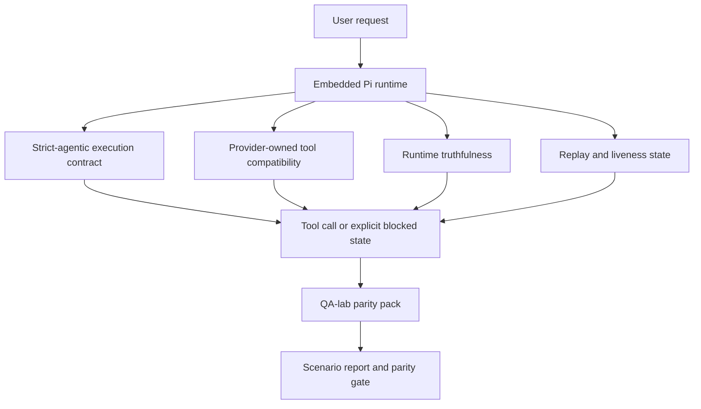
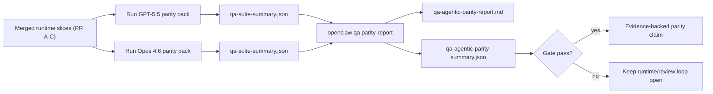

---
read_when:
    - 偵錯 GPT-5.5 或 Codex 代理程式行為
    - 比較 OpenClaw 在不同前沿模型中的智能體行為
    - 檢閱嚴格代理式、工具結構描述、權限提升與重播修正
summary: OpenClaw 如何彌合 GPT-5.5 與 Codex 風格模型的代理式執行落差
title: GPT-5.5 / Codex 代理式同等能力
x-i18n:
    generated_at: "2026-05-06T02:49:21Z"
    model: gpt-5.5
    provider: openai
    source_hash: bbc32f418dfffe2786093fa6b42b19f92a2d382c9408dfc55dd0154d67959390
    source_path: help/gpt55-codex-agentic-parity.md
    workflow: 16
---

OpenClaw 已經能很好地配合使用工具的前沿模型，但 GPT-5.5 和 Codex 風格的模型在幾個實務面向上仍表現不足：

- 它們可能在規劃後就停止，而不是實際完成工作
- 它們可能錯誤使用嚴格的 OpenAI/Codex 工具結構描述
- 即使完整存取權限不可能取得，它們也可能要求 `/elevated full`
- 它們可能在重播或 Compaction 期間遺失長時間執行工作的狀態
- 與 Claude Opus 4.6 的同等性主張是基於軼聞，而不是可重複的情境

這個同等性計畫以四個可審查的切片修補這些缺口。

## 變更內容

### PR A：strict-agentic 執行

這個切片為內嵌 Pi GPT-5 執行新增一個可選啟用的 `strict-agentic` 執行合約。

啟用後，OpenClaw 不再接受只提出計畫的回合，把它當成「夠好」的完成。如果模型只說明打算做什麼，卻沒有實際使用工具或取得進展，OpenClaw 會以立即行動的引導重試，接著以明確的受阻狀態封閉失敗，而不是默默結束工作。

這最能改善 GPT-5.5 在以下情境中的體驗：

- 簡短的「好，做吧」後續回覆
- 第一個步驟很明確的程式碼工作
- `update_plan` 應該用於進度追蹤，而不是填充文字的流程

### PR B：執行階段真實性

這個切片讓 OpenClaw 如實說明兩件事：

- provider/runtime 呼叫失敗的原因
- `/elevated full` 是否實際可用

這表示 GPT-5.5 會取得更好的執行階段訊號，涵蓋缺少作用域、驗證重新整理失敗、HTML 403 驗證失敗、代理問題、DNS 或逾時失敗，以及被封鎖的完整存取模式。模型比較不會幻覺出錯誤的修復方式，也比較不會持續要求執行階段無法提供的權限模式。

### PR C：執行正確性

這個切片改善兩種正確性：

- provider 擁有的 OpenAI/Codex 工具結構描述相容性
- 重播和長時間工作存活狀態的呈現

工具相容性工作降低了嚴格 OpenAI/Codex 工具註冊的結構描述摩擦，特別是無參數工具和嚴格物件根層級預期。重播/存活狀態工作讓長時間執行工作更可觀測，因此暫停、受阻和遭放棄的狀態會可見，而不是消失在泛用失敗文字中。

### PR D：同等性測試工具

這個切片新增第一波 QA-lab 同等性套件，讓 GPT-5.5 和 Opus 4.6 可以透過相同情境執行，並使用共享證據比較。

同等性套件是證明層。它本身不會變更執行階段行為。

取得兩個 `qa-suite-summary.json` 成品後，使用以下指令產生 release-gate 比較：

```bash
pnpm openclaw qa parity-report \
  --repo-root . \
  --candidate-summary .artifacts/qa-e2e/gpt55/qa-suite-summary.json \
  --baseline-summary .artifacts/qa-e2e/opus46/qa-suite-summary.json \
  --output-dir .artifacts/qa-e2e/parity
```

該指令會寫入：

- 人類可讀的 Markdown 報告
- 機器可讀的 JSON 判定
- 明確的 `pass` / `fail` 閘門結果

## 為什麼這會在實務上改善 GPT-5.5

在這項工作之前，GPT-5.5 在 OpenClaw 上的真實程式碼工作階段中，可能感覺比 Opus 更缺乏代理性，因為執行階段容忍了對 GPT-5 風格模型特別有害的行為：

- 只有註解說明的回合
- 工具周圍的結構描述摩擦
- 模糊的權限回饋
- 靜默的重播或 Compaction 破損

目標不是讓 GPT-5.5 模仿 Opus。目標是給 GPT-5.5 一個會獎勵真實進展的執行階段合約，提供更清楚的工具與權限語意，並將失敗模式轉換成明確、機器與人類皆可讀的狀態。

這會把使用者體驗從：

- 「模型有個好計畫，但停下來了」

改為：

- 「模型要嘛已經行動，要嘛 OpenClaw 呈現它無法行動的確切原因」

## GPT-5.5 使用者的前後差異

| 這個計畫之前                                                                                   | PR A-D 之後                                                                            |
| ---------------------------------------------------------------------------------------------- | ---------------------------------------------------------------------------------------- |
| GPT-5.5 可能在提出合理計畫後停止，而不採取下一個工具步驟                                      | PR A 將「只有計畫」轉為「立即行動，或呈現受阻狀態」                                     |
| 嚴格工具結構描述可能以令人困惑的方式拒絕無參數或 OpenAI/Codex 形狀的工具                      | PR C 讓 provider 擁有的工具註冊與呼叫更可預測                                           |
| `/elevated full` 指引在受阻執行階段中可能模糊或錯誤                                            | PR B 給 GPT-5.5 和使用者真實的執行階段與權限提示                                        |
| 重播或 Compaction 失敗可能讓人感覺工作默默消失                                                 | PR C 明確呈現暫停、受阻、遭放棄和重播無效結果                                           |
| 「GPT-5.5 感覺比 Opus 差」大多只是軼聞                                                         | PR D 將其轉為相同情境套件、相同指標和硬性通過/失敗閘門                                  |

## 架構



## 發布流程



## 情境套件

第一波同等性套件目前涵蓋五個情境：

### `approval-turn-tool-followthrough`

檢查模型在簡短核准後，不會停在「我會做那件事」。它應該在同一回合採取第一個具體行動。

### `model-switch-tool-continuity`

檢查使用工具的工作在模型/執行階段切換邊界之間仍保持一致，而不是重設為註解說明或遺失執行內容脈絡。

### `source-docs-discovery-report`

檢查模型能否閱讀原始碼和文件、綜合發現，並以代理方式繼續工作，而不是產生薄弱摘要後提早停止。

### `image-understanding-attachment`

檢查涉及附件的混合模式工作是否仍可行動，且不會坍縮成模糊敘述。

### `compaction-retry-mutating-tool`

檢查含有真實變更寫入的工作是否讓重播不安全性保持明確，而不是在執行發生 Compaction、重試或在壓力下遺失回覆狀態時，安靜地看起來像是重播安全。

## 情境矩陣

| 情境                               | 測試內容                                | 良好的 GPT-5.5 行為                                                            | 失敗訊號                                                                       |
| ---------------------------------- | --------------------------------------- | ------------------------------------------------------------------------------ | ------------------------------------------------------------------------------ |
| `approval-turn-tool-followthrough` | 計畫後的簡短核准回合                    | 立即開始第一個具體工具行動，而不是重述意圖                                     | 只有計畫的後續回覆、沒有工具活動，或沒有真實阻礙卻進入受阻回合               |
| `model-switch-tool-continuity`     | 使用工具時的執行階段/模型切換           | 保留工作內容脈絡，並一致地持續行動                                             | 重設為註解說明、遺失工具內容脈絡，或切換後停止                                |
| `source-docs-discovery-report`     | 原始碼閱讀 + 綜合 + 行動                | 找到來源、使用工具，並產生有用報告而不卡住                                     | 薄弱摘要、缺少工具工作，或未完成回合就停止                                     |
| `image-understanding-attachment`   | 附件驅動的代理工作                      | 解讀附件、將它連結到工具，並繼續工作                                           | 模糊敘述、忽略附件，或沒有具體下一步行動                                       |
| `compaction-retry-mutating-tool`   | Compaction 壓力下的變更工作             | 執行真實寫入，並在副作用後保持重播不安全性明確                                 | 發生變更寫入，但重播安全性被暗示、缺失或互相矛盾                              |

## 發布閘門

只有在合併後的執行階段同時通過同等性套件與執行階段真實性回歸測試時，GPT-5.5 才能被視為達到或超越同等性。

必要結果：

- 當下一個工具行動很明確時，不會只有計畫而卡住
- 不會在沒有真實執行的情況下假完成
- 不會給出錯誤的 `/elevated full` 指引
- 不會靜默重播或放棄 Compaction
- 同等性套件指標至少與約定的 Opus 4.6 基準一樣強

對於第一波測試工具，閘門會比較：

- 完成率
- 非預期停止率
- 有效工具呼叫率
- 假成功計數

同等性證據刻意分成兩層：

- PR D 以 QA-lab 證明相同情境下 GPT-5.5 與 Opus 4.6 的行為
- PR B 的決定性套件在測試工具之外證明驗證、代理、DNS 和 `/elevated full` 真實性

## 目標到證據矩陣

| 完成閘門項目                                             | 擁有 PR     | 證據來源                                                           | 通過訊號                                                                                 |
| -------------------------------------------------------- | ----------- | ------------------------------------------------------------------ | ---------------------------------------------------------------------------------------- |
| GPT-5.5 不再於規劃後卡住                                 | PR A        | `approval-turn-tool-followthrough` 加上 PR A 執行階段套件          | 核准回合觸發真實工作或明確的受阻狀態                                                     |
| GPT-5.5 不再假裝有進展或假裝工具完成                     | PR A + PR D | 同等性報告情境結果和假成功計數                                     | 沒有可疑的通過結果，也沒有只有註解說明的完成                                             |
| GPT-5.5 不再給出錯誤的 `/elevated full` 指引             | PR B        | 決定性真實性套件                                                   | 受阻原因與完整存取提示保持執行階段準確                                                   |
| 重播/存活狀態失敗保持明確                                | PR C + PR D | PR C 生命週期/重播套件加上 `compaction-retry-mutating-tool`        | 變更工作保持重播不安全性明確，而不是默默消失                                             |
| GPT-5.5 在約定指標上追平或超越 Opus 4.6                  | PR D        | `qa-agentic-parity-report.md` 和 `qa-agentic-parity-summary.json`  | 相同情境涵蓋範圍，且在完成、停止行為或有效工具使用上沒有回歸                             |

## 如何閱讀同等性判定

將 `qa-agentic-parity-summary.json` 中的判定作為第一波同等性套件的最終機器可讀決策。

- `pass` 表示 GPT-5.5 涵蓋了與 Opus 4.6 相同的情境，且在已同意的彙總指標上沒有退步。
- `fail` 表示至少觸發了一個硬性門檻：完成能力較弱、非預期停止更嚴重、有效工具使用較弱、任何假成功案例，或情境覆蓋不一致。
- 「共享/基礎 CI 問題」本身並不是同等性結果。如果 PR D 以外的 CI 雜訊阻擋執行，結論應等待乾淨的合併後執行階段執行結果，而不是從分支時期的日誌推斷。
- Auth、proxy、DNS 和 `/elevated full` 真實性仍來自 PR B 的確定性套件，因此最終發布主張需要兩者兼具：通過的 PR D 同等性結論，以及綠燈的 PR B 真實性覆蓋。

## 誰應該啟用 `strict-agentic`

在下列情況使用 `strict-agentic`：

- 當下一步很明顯時，預期代理會立即行動
- GPT-5.5 或 Codex 系列模型是主要執行階段
- 你偏好明確的受阻狀態，而不是「有幫助」但只有摘要的回覆

在下列情況保留預設合約：

- 你想要現有較寬鬆的行為
- 你未使用 GPT-5 系列模型
- 你在測試提示，而不是執行階段強制執行

## 相關

- [GPT-5.5 / Codex 同等性維護者備註](/zh-TW/help/gpt55-codex-agentic-parity-maintainers)
