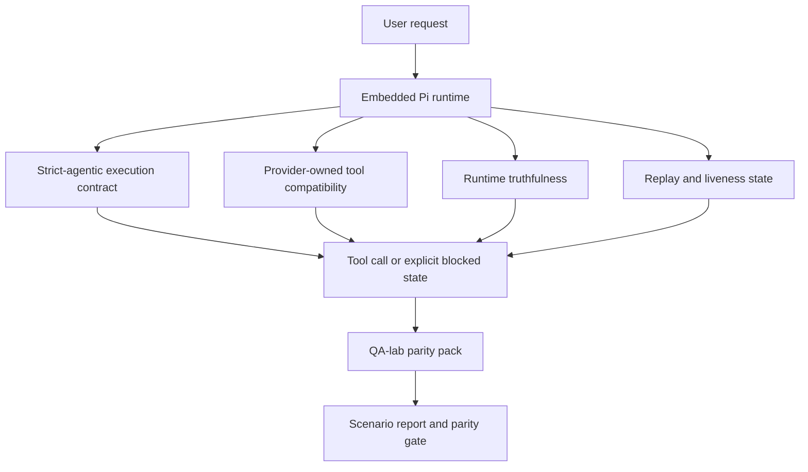
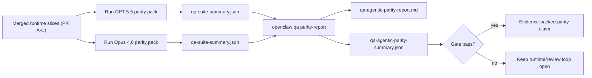

---
read_when:
    - 偵錯 GPT-5.5 或 Codex 代理行為
    - 比較 OpenClaw 在前沿模型間的代理式行為
    - 檢閱嚴格代理式、工具結構描述、提權與重放修正
summary: OpenClaw 如何為 GPT-5.5 與 Codex 風格模型彌合代理式執行缺口
title: GPT-5.5 / Codex 代理能力同等性
x-i18n:
    generated_at: "2026-04-30T03:11:50Z"
    model: gpt-5.5
    provider: openai
    source_hash: 8a3b9375cd9e9d95855c4a1135953e00fd7a939e52fb7b75342da3bde2d83fe1
    source_path: help/gpt55-codex-agentic-parity.md
    workflow: 16
---

# OpenClaw 中 GPT-5.5 / Codex 的代理式對等能力

OpenClaw 已經能很好地搭配使用工具的前沿模型運作，但 GPT-5.5 與 Codex 風格模型在幾個實務面向仍表現不足：

- 它們可能會在規劃後停止，而不是實際完成工作
- 它們可能會錯誤使用嚴格的 OpenAI/Codex 工具結構描述
- 即使完整存取權限不可能提供，它們也可能要求 `/elevated full`
- 它們可能會在重播或 Compaction 期間遺失長時間執行任務的狀態
- 與 Claude Opus 4.6 相比的對等能力宣稱，是基於軼聞而非可重複的情境

這項對等能力計畫會以四個可審查的切片修正這些缺口。

## 變更內容

### PR A：嚴格代理式執行

這個切片為內嵌 Pi GPT-5 執行加入選用的 `strict-agentic` 執行合約。

啟用後，OpenClaw 不再接受只提供計畫的回合，並將其視為「足夠好」的完成。如果模型只說明打算做什麼，卻沒有實際使用工具或推進進度，OpenClaw 會以立即行動的引導重試，接著以明確的受阻狀態封閉失敗，而不是默默結束任務。

這對 GPT-5.5 體驗的改善最明顯出現在：

- 簡短的「好，做吧」後續回覆
- 第一個步驟很明顯的程式碼任務
- `update_plan` 應該用於追蹤進度，而不是填充文字的流程

### PR B：執行階段真實性

這個切片讓 OpenClaw 如實說明兩件事：

- 為什麼供應商/執行階段呼叫失敗
- `/elevated full` 是否真的可用

這表示 GPT-5.5 會取得更好的執行階段訊號，涵蓋缺少範圍、驗證重新整理失敗、HTML 403 驗證失敗、代理問題、DNS 或逾時失敗，以及受阻的完整存取模式。模型較不容易幻覺出錯誤的修復方式，或持續要求執行階段無法提供的權限模式。

### PR C：執行正確性

這個切片改善兩類正確性：

- 供應商擁有的 OpenAI/Codex 工具結構描述相容性
- 重播與長任務存活狀態揭露

工具相容性工作降低了嚴格 OpenAI/Codex 工具註冊的結構描述摩擦，特別是針對無參數工具與嚴格物件根層級預期。重播/存活狀態工作讓長時間執行任務更容易觀察，因此暫停、受阻與遭放棄的狀態會可見，而不是消失在泛用失敗文字中。

### PR D：對等能力測試框架

這個切片加入第一波 QA-lab 對等能力套件，讓 GPT-5.5 與 Opus 4.6 能透過相同情境演練，並使用共享證據比較。

對等能力套件是證明層。它本身不會改變執行階段行為。

取得兩個 `qa-suite-summary.json` 成品後，使用以下命令產生發布門檻比較：

```bash
pnpm openclaw qa parity-report \
  --repo-root . \
  --candidate-summary .artifacts/qa-e2e/gpt55/qa-suite-summary.json \
  --baseline-summary .artifacts/qa-e2e/opus46/qa-suite-summary.json \
  --output-dir .artifacts/qa-e2e/parity
```

該命令會寫入：

- 可供人閱讀的 Markdown 報告
- 可供機器讀取的 JSON 判定
- 明確的 `pass` / `fail` 門檻結果

## 為什麼這會在實務上改善 GPT-5.5

在這項工作之前，OpenClaw 上的 GPT-5.5 在真實程式碼工作階段中可能感覺比 Opus 更不像代理，因為執行階段容忍了對 GPT-5 風格模型特別有害的行為：

- 只有評論的回合
- 工具周圍的結構描述摩擦
- 模糊的權限回饋
- 靜默的重播或 Compaction 損壞

目標不是讓 GPT-5.5 模仿 Opus。目標是提供 GPT-5.5 一個執行階段合約，用來獎勵真正的進度、提供更乾淨的工具與權限語義，並將失敗模式轉化為明確、機器與人都可讀的狀態。

這會將使用者體驗從：

- 「模型有很好的計畫，但停止了」

轉變為：

- 「模型要嘛採取了行動，要嘛 OpenClaw 揭露它無法行動的確切原因」

## GPT-5.5 使用者的前後差異

| 這項計畫之前                                                                                   | PR A-D 之後                                                                            |
| ---------------------------------------------------------------------------------------------- | ---------------------------------------------------------------------------------------- |
| GPT-5.5 可能會在合理計畫後停止，而不採取下一個工具步驟                   | PR A 會將「只有計畫」轉化為「立即行動或揭露受阻狀態」                         |
| 嚴格工具結構描述可能以令人困惑的方式拒絕無參數或 OpenAI/Codex 形狀的工具 | PR C 讓供應商擁有的工具註冊與呼叫更可預期              |
| `/elevated full` 指引在受阻執行階段中可能模糊或錯誤                          | PR B 會給 GPT-5.5 與使用者真實的執行階段與權限提示                    |
| 重播或 Compaction 失敗可能讓人覺得任務默默消失                    | PR C 會明確揭露暫停、受阻、遭放棄與重播無效的結果         |
| 「GPT-5.5 感覺比 Opus 差」大多只是軼聞                                           | PR D 會將其轉化為相同情境套件、相同指標，以及硬性的通過/失敗門檻 |

## 架構



## 發布流程



## 情境套件

第一波對等能力套件目前涵蓋五個情境：

### `approval-turn-tool-followthrough`

檢查模型在簡短核准後不會停在「我會做那件事」。它應該在同一回合採取第一個具體行動。

### `model-switch-tool-continuity`

檢查使用工具的工作在模型/執行階段切換邊界之間仍保持一致，而不是重設為評論或遺失執行脈絡。

### `source-docs-discovery-report`

檢查模型能否閱讀來源與文件、綜合發現，並以代理方式繼續任務，而不是產生薄弱摘要後提早停止。

### `image-understanding-attachment`

檢查涉及附件的混合模式任務是否仍可執行，且不會退化成模糊敘述。

### `compaction-retry-mutating-tool`

檢查具有真正變更寫入的任務，在執行壓力下發生 Compaction、重試或遺失回覆狀態時，是否會讓重播不安全性保持明確，而不是安靜地看起來可安全重播。

## 情境矩陣

| 情境                           | 測試內容                           | 良好的 GPT-5.5 行為                                                          | 失敗訊號                                                                 |
| ---------------------------------- | --------------------------------------- | ------------------------------------------------------------------------------ | ------------------------------------------------------------------------------ |
| `approval-turn-tool-followthrough` | 計畫後的簡短核准回合       | 立即開始第一個具體工具行動，而不是重申意圖  | 只有計畫的後續回覆、沒有工具活動，或沒有真正阻礙因素的受阻回合  |
| `model-switch-tool-continuity`     | 使用工具時的執行階段/模型切換  | 保留任務脈絡並持續一致地行動                         | 重設為評論、遺失工具脈絡，或切換後停止              |
| `source-docs-discovery-report`     | 來源閱讀 + 綜合 + 行動     | 找到來源、使用工具，並在不中途停滯的情況下產出有用報告       | 薄弱摘要、缺少工具工作，或未完成回合即停止                       |
| `image-understanding-attachment`   | 附件驅動的代理式工作          | 解讀附件、將其連接到工具，並繼續任務        | 模糊敘述、忽略附件，或沒有具體下一步行動                |
| `compaction-retry-mutating-tool`   | Compaction 壓力下的變更工作 | 執行真正寫入，並在副作用後保持重播不安全性明確 | 發生變更寫入，但重播安全性被暗示、缺失或自相矛盾 |

## 發布門檻

只有當合併後的執行階段同時通過對等能力套件與執行階段真實性迴歸時，GPT-5.5 才能被視為達到或超越對等能力。

必要結果：

- 當下一個工具行動很明確時，不會出現只有計畫的停滯
- 不會在沒有真正執行的情況下假完成
- 不會提供錯誤的 `/elevated full` 指引
- 不會靜默放棄重播或 Compaction
- 對等能力套件指標至少與已同意的 Opus 4.6 基準一樣強

對於第一波測試框架，門檻會比較：

- 完成率
- 非預期停止率
- 有效工具呼叫率
- 假成功計數

對等能力證據刻意分成兩層：

- PR D 透過 QA-lab 證明相同情境下的 GPT-5.5 與 Opus 4.6 行為
- PR B 的確定性套件證明測試框架之外的驗證、代理、DNS 與 `/elevated full` 真實性

## 目標到證據矩陣

| 完成門檻項目                                     | 負責 PR   | 證據來源                                                    | 通過訊號                                                                              |
| -------------------------------------------------------- | ----------- | ------------------------------------------------------------------ | ---------------------------------------------------------------------------------------- |
| GPT-5.5 不再在規劃後停滯                  | PR A        | `approval-turn-tool-followthrough` 加上 PR A 執行階段套件        | 核准回合會觸發真正工作或明確的受阻狀態                            |
| GPT-5.5 不再假裝進度或假工具完成 | PR A + PR D | 對等能力報告情境結果與假成功計數             | 沒有可疑的通過結果，也沒有只有評論的完成                             |
| GPT-5.5 不再提供錯誤的 `/elevated full` 指引  | PR B        | 確定性真實性套件                                  | 受阻原因與完整存取提示維持執行階段準確性                              |
| 重播/存活狀態失敗保持明確                   | PR C + PR D | PR C 生命週期/重播套件加上 `compaction-retry-mutating-tool` | 變更工作會保持重播不安全性明確，而不是默默消失            |
| GPT-5.5 在已同意的指標上符合或勝過 Opus 4.6  | PR D        | `qa-agentic-parity-report.md` 與 `qa-agentic-parity-summary.json` | 相同情境涵蓋範圍，且在完成、停止行為或有效工具使用上沒有迴歸 |

## 如何閱讀對等能力判定

使用 `qa-agentic-parity-summary.json` 中的判定，作為第一波對等能力套件的最終機器可讀決策。

- `pass` 表示 GPT-5.5 涵蓋了與 Opus 4.6 相同的情境，且在已同意的彙總指標上沒有退步。
- `fail` 表示至少觸發了一項硬性門檻：完成表現較弱、非預期停止更嚴重、有效工具使用較弱、任何假成功案例，或情境涵蓋不一致。
- 「共用/基礎 CI 問題」本身不是對等性結果。如果 PR D 之外的 CI 雜訊阻擋了一次執行，判定應等待乾淨的合併後執行階段執行，而不是從分支階段的記錄推論。
- 驗證、代理、DNS 與 `/elevated full` 的真實性仍來自 PR B 的確定性套件，因此最終發布聲明需要兩者兼具：PR D 對等性判定通過，以及 PR B 真實性涵蓋為綠燈。

## 誰應該啟用 `strict-agentic`

在以下情況使用 `strict-agentic`：

- 當下一步很明顯時，預期代理會立即採取行動
- GPT-5.5 或 Codex 系列模型是主要執行階段
- 相較於「有幫助」但只做摘要的回覆，你更偏好明確的受阻狀態

在以下情況保留預設合約：

- 你想要現有較寬鬆的行為
- 你沒有使用 GPT-5 系列模型
- 你是在測試提示，而不是執行階段強制執行

## 相關

- [GPT-5.5 / Codex 對等性維護者備註](/zh-TW/help/gpt55-codex-agentic-parity-maintainers)
