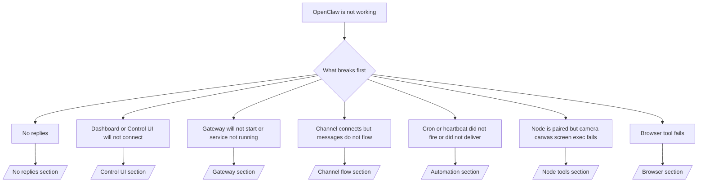

---
read_when:
    - OpenClaw 無法正常運作，而你需要最快的修復途徑
    - 你想在深入詳盡的操作手冊前，先有一套分流流程
summary: OpenClaw 以症狀為優先的疑難排解中心
title: 一般疑難排解
x-i18n:
    generated_at: "2026-04-30T03:12:30Z"
    model: gpt-5.5
    provider: openai
    source_hash: c832c3f7609c56a5461515ed0f693d2255310bf2d3958f69f57c482bcbef97f0
    source_path: help/troubleshooting.md
    workflow: 16
---

如果你只有 2 分鐘，請把本頁當作分流入口。

## 前 60 秒

依序執行這個精確階梯：

```bash
openclaw status
openclaw status --all
openclaw gateway probe
openclaw gateway status
openclaw doctor
openclaw channels status --probe
openclaw logs --follow
```

一行中的良好輸出：

- `openclaw status` → 顯示已設定的頻道，且沒有明顯的驗證錯誤。
- `openclaw status --all` → 完整報告存在且可分享。
- `openclaw gateway probe` → 預期的 gateway 目標可連線（`Reachable: yes`）。`Capability: ...` 會告訴你探測可證明的驗證層級，而 `Read probe: limited - missing scope: operator.read` 是降級診斷，不是連線失敗。
- `openclaw gateway status` → `Runtime: running`、`Connectivity probe: ok`，以及合理的 `Capability: ...` 行。如果你也需要讀取範圍的 RPC 證明，請使用 `--require-rpc`。
- `openclaw doctor` → 沒有阻塞性的設定或服務錯誤。
- `openclaw channels status --probe` → 可連線的 Gateway 會回傳即時的逐帳號傳輸狀態，以及像 `works` 或 `audit ok` 這類探測/稽核結果；如果 Gateway 無法連線，此命令會退回僅含設定的摘要。
- `openclaw logs --follow` → 活動穩定，沒有重複的嚴重錯誤。

## Anthropic 長上下文 429

如果你看到：
`HTTP 429: rate_limit_error: Extra usage is required for long context requests`，
請前往 [/gateway/troubleshooting#anthropic-429-extra-usage-required-for-long-context](/zh-TW/gateway/troubleshooting#anthropic-429-extra-usage-required-for-long-context)。

## 本機 OpenAI 相容後端可直接運作，但在 OpenClaw 中失敗

如果你的本機或自託管 `/v1` 後端能回應小型直接
`/v1/chat/completions` 探測，但在 `openclaw infer model run` 或一般
agent 回合中失敗：

1. 如果錯誤提到 `messages[].content` 預期為字串，請設定
   `models.providers.<provider>.models[].compat.requiresStringContent: true`。
2. 如果後端仍然只在 OpenClaw agent 回合中失敗，請設定
   `models.providers.<provider>.models[].compat.supportsTools: false` 後重試。
3. 如果極小的直接呼叫仍可運作，但較大的 OpenClaw 提示會讓後端當機，請將剩餘問題視為上游模型/伺服器限制，並繼續閱讀深入執行手冊：
   [/gateway/troubleshooting#local-openai-compatible-backend-passes-direct-probes-but-agent-runs-fail](/zh-TW/gateway/troubleshooting#local-openai-compatible-backend-passes-direct-probes-but-agent-runs-fail)

## Plugin 安裝因缺少 openclaw extensions 而失敗

如果安裝失敗並顯示 `package.json missing openclaw.extensions`，表示該 plugin 套件使用的是 OpenClaw 不再接受的舊格式。

在 plugin 套件中修正：

1. 將 `openclaw.extensions` 加入 `package.json`。
2. 將項目指向已建置的執行階段檔案（通常是 `./dist/index.js`）。
3. 重新發布 plugin，並再次執行 `openclaw plugins install <package>`。

範例：

```json
{
  "name": "@openclaw/my-plugin",
  "version": "1.2.3",
  "openclaw": {
    "extensions": ["./dist/index.js"]
  }
}
```

參考：[Plugin 架構](/zh-TW/plugins/architecture)

## 決策樹



<AccordionGroup>
  <Accordion title="沒有回覆">
    ```bash
    openclaw status
    openclaw gateway status
    openclaw channels status --probe
    openclaw pairing list --channel <channel> [--account <id>]
    openclaw logs --follow
    ```

    良好輸出看起來像：

    - `Runtime: running`
    - `Connectivity probe: ok`
    - `Capability: read-only`、`write-capable` 或 `admin-capable`
    - 你的頻道顯示傳輸已連線，且在支援時，`channels status --probe` 中會出現 `works` 或 `audit ok`
    - 傳送者顯示為已核准（或私訊政策為開放/允許清單）

    常見日誌特徵：

    - `drop guild message (mention required` → Discord 中提及門檻封鎖了訊息。
    - `pairing request` → 傳送者尚未核准，正在等待私訊配對核准。
    - 頻道日誌中的 `blocked` / `allowlist` → 傳送者、聊天室或群組已被篩選。

    深入頁面：

    - [/gateway/troubleshooting#no-replies](/zh-TW/gateway/troubleshooting#no-replies)
    - [/channels/troubleshooting](/zh-TW/channels/troubleshooting)
    - [/channels/pairing](/zh-TW/channels/pairing)

  </Accordion>

  <Accordion title="Dashboard 或 Control UI 無法連線">
    ```bash
    openclaw status
    openclaw gateway status
    openclaw logs --follow
    openclaw doctor
    openclaw channels status --probe
    ```

    良好輸出看起來像：

    - `openclaw gateway status` 中顯示 `Dashboard: http://...`
    - `Connectivity probe: ok`
    - `Capability: read-only`、`write-capable` 或 `admin-capable`
    - 日誌中沒有驗證迴圈

    常見日誌特徵：

    - `device identity required` → HTTP/非安全環境無法完成裝置驗證。
    - `origin not allowed` → 瀏覽器 `Origin` 不被 Control UI
      Gateway 目標允許。
    - `AUTH_TOKEN_MISMATCH` 並帶有重試提示（`canRetryWithDeviceToken=true`）→ 可能會自動發生一次受信任裝置權杖重試。
    - 該快取權杖重試會重用與已配對裝置權杖一起儲存的快取範圍集合。明確的 `deviceToken` / 明確的 `scopes` 呼叫者會保留其要求的範圍集合。
    - 在非同步 Tailscale Serve Control UI 路徑上，同一個
      `{scope, ip}` 的失敗嘗試會在限制器記錄失敗前被序列化，因此第二個並行的錯誤重試可能已經顯示 `retry later`。
    - localhost 瀏覽器來源出現 `too many failed authentication attempts (retry later)` → 來自相同 `Origin` 的重複失敗會暫時被鎖定；另一個 localhost 來源使用不同的儲存桶。
    - 該重試後重複出現 `unauthorized` → 權杖/密碼錯誤、驗證模式不相符，或已配對裝置權杖過期。
    - `gateway connect failed:` → UI 指向錯誤的 URL/連接埠，或 Gateway 無法連線。

    深入頁面：

    - [/gateway/troubleshooting#dashboard-control-ui-connectivity](/zh-TW/gateway/troubleshooting#dashboard-control-ui-connectivity)
    - [/web/control-ui](/zh-TW/web/control-ui)
    - [/gateway/authentication](/zh-TW/gateway/authentication)

  </Accordion>

  <Accordion title="Gateway 無法啟動，或服務已安裝但未執行">
    ```bash
    openclaw status
    openclaw gateway status
    openclaw logs --follow
    openclaw doctor
    openclaw channels status --probe
    ```

    良好輸出看起來像：

    - `Service: ... (loaded)`
    - `Runtime: running`
    - `Connectivity probe: ok`
    - `Capability: read-only`、`write-capable` 或 `admin-capable`

    常見日誌特徵：

    - `Gateway start blocked: set gateway.mode=local` 或 `existing config is missing gateway.mode` → gateway 模式為遠端，或設定檔缺少本機模式標記，應修復。
    - `refusing to bind gateway ... without auth` → 在沒有有效 Gateway 驗證路徑（權杖/密碼，或已設定的 trusted-proxy）的情況下綁定非 loopback 位址。
    - `another gateway instance is already listening` 或 `EADDRINUSE` → 連接埠已被使用。

    深入頁面：

    - [/gateway/troubleshooting#gateway-service-not-running](/zh-TW/gateway/troubleshooting#gateway-service-not-running)
    - [/gateway/background-process](/zh-TW/gateway/background-process)
    - [/gateway/configuration](/zh-TW/gateway/configuration)

  </Accordion>

  <Accordion title="頻道已連線但訊息未流動">
    ```bash
    openclaw status
    openclaw gateway status
    openclaw logs --follow
    openclaw doctor
    openclaw channels status --probe
    ```

    良好輸出看起來像：

    - 頻道傳輸已連線。
    - 配對/允許清單檢查通過。
    - 在需要時偵測到提及。

    常見日誌特徵：

    - `mention required` → 群組提及門檻封鎖了處理。
    - `pairing` / `pending` → 私訊傳送者尚未核准。
    - `not_in_channel`、`missing_scope`、`Forbidden`、`401/403` → 頻道權限權杖問題。

    深入頁面：

    - [/gateway/troubleshooting#channel-connected-messages-not-flowing](/zh-TW/gateway/troubleshooting#channel-connected-messages-not-flowing)
    - [/channels/troubleshooting](/zh-TW/channels/troubleshooting)

  </Accordion>

  <Accordion title="Cron 或 Heartbeat 未觸發或未送達">
    ```bash
    openclaw status
    openclaw gateway status
    openclaw cron status
    openclaw cron list
    openclaw cron runs --id <jobId> --limit 20
    openclaw logs --follow
    ```

    良好輸出看起來像：

    - `cron.status` 顯示已啟用並有下一次喚醒。
    - `cron runs` 顯示近期的 `ok` 項目。
    - Heartbeat 已啟用，且未超出活動時段。

    常見日誌特徵：

    - `cron: scheduler disabled; jobs will not run automatically` → cron 已停用。
    - `heartbeat skipped` 並帶有 `reason=quiet-hours` → 超出已設定的活動時段。
    - `heartbeat skipped` 並帶有 `reason=empty-heartbeat-file` → `HEARTBEAT.md` 存在，但只包含空白/僅標題的鷹架內容。
    - `heartbeat skipped` 並帶有 `reason=no-tasks-due` → `HEARTBEAT.md` 任務模式已啟用，但尚未到達任何任務間隔。
    - `heartbeat skipped` 並帶有 `reason=alerts-disabled` → 所有 heartbeat 可見性皆已停用（`showOk`、`showAlerts` 和 `useIndicator` 全部關閉）。
    - `requests-in-flight` → 主要通道忙碌；heartbeat 喚醒已延後。
    - `unknown accountId` → heartbeat 傳遞目標帳號不存在。

    深入頁面：

    - [/gateway/troubleshooting#cron-and-heartbeat-delivery](/zh-TW/gateway/troubleshooting#cron-and-heartbeat-delivery)
    - [/automation/cron-jobs#troubleshooting](/zh-TW/automation/cron-jobs#troubleshooting)
    - [/gateway/heartbeat](/zh-TW/gateway/heartbeat)

  </Accordion>

  <Accordion title="Node 已配對，但工具在 camera canvas screen exec 上失敗">
    ```bash
    openclaw status
    openclaw gateway status
    openclaw nodes status
    openclaw nodes describe --node <idOrNameOrIp>
    openclaw logs --follow
    ```

    良好輸出看起來像：

    - Node 以 `node` 角色列為已連線且已配對。
    - 你正在呼叫的命令具備 Capability。
    - 該工具的權限狀態為已授予。

    常見日誌特徵：

    - `NODE_BACKGROUND_UNAVAILABLE` → 將 node 應用程式帶到前景。
    - `*_PERMISSION_REQUIRED` → 作業系統權限被拒絕/缺失。
    - `SYSTEM_RUN_DENIED: approval required` → exec 核准待處理。
    - `SYSTEM_RUN_DENIED: allowlist miss` → 命令不在 exec 允許清單中。

    深入頁面：

    - [/gateway/troubleshooting#node-paired-tool-fails](/zh-TW/gateway/troubleshooting#node-paired-tool-fails)
    - [/nodes/troubleshooting](/zh-TW/nodes/troubleshooting)
    - [/tools/exec-approvals](/zh-TW/tools/exec-approvals)

  </Accordion>

  <Accordion title="Exec 突然要求核准">
    ```bash
    openclaw config get tools.exec.host
    openclaw config get tools.exec.security
    openclaw config get tools.exec.ask
    openclaw gateway restart
    ```

    變更內容：

    - 如果未設定 `tools.exec.host`，預設值為 `auto`。
    - 當沙箱執行階段處於作用中時，`host=auto` 會解析為 `sandbox`，否則解析為 `gateway`。
    - `host=auto` 只負責路由；無提示的「YOLO」行為來自 Gateway/Node 上的 `security=full` 加上 `ask=off`。
    - 在 `gateway` 和 `node` 上，未設定的 `tools.exec.security` 預設為 `full`。
    - 未設定的 `tools.exec.ask` 預設為 `off`。
    - 結果：如果你看到核准提示，表示某些主機本機或每次工作階段政策將 exec 收緊到不同於目前預設值的狀態。

    還原目前預設的免核准行為：

    ```bash
    openclaw config set tools.exec.host gateway
    openclaw config set tools.exec.security full
    openclaw config set tools.exec.ask off
    openclaw gateway restart
    ```

    較安全的替代方案：

    - 如果只想要穩定的主機路由，只設定 `tools.exec.host=gateway`。
    - 如果你想使用主機 exec，但仍想在 allowlist 未命中時進行審查，請使用 `security=allowlist` 搭配 `ask=on-miss`。
    - 如果你想讓 `host=auto` 解析回 `sandbox`，請啟用沙箱模式。

    常見記錄特徵：

    - `Approval required.` → 命令正在等待 `/approve ...`。
    - `SYSTEM_RUN_DENIED: approval required` → node-host exec 核准擱置中。
    - `exec host=sandbox requires a sandbox runtime for this session` → 隱含/明確選擇了沙箱，但沙箱模式已關閉。

    深入頁面：

    - [/tools/exec](/zh-TW/tools/exec)
    - [/tools/exec-approvals](/zh-TW/tools/exec-approvals)
    - [/gateway/security#what-the-audit-checks-high-level](/zh-TW/gateway/security#what-the-audit-checks-high-level)

  </Accordion>

  <Accordion title="瀏覽器工具失敗">
    ```bash
    openclaw status
    openclaw gateway status
    openclaw browser status
    openclaw logs --follow
    openclaw doctor
    ```

    良好的輸出看起來如下：

    - 瀏覽器狀態顯示 `running: true` 以及選定的瀏覽器/設定檔。
    - `openclaw` 啟動，或 `user` 可以看到本機 Chrome 分頁。

    常見記錄特徵：

    - `unknown command "browser"` 或 `unknown command 'browser'` → 已設定 `plugins.allow`，但未包含 `browser`。
    - `Failed to start Chrome CDP on port` → 本機瀏覽器啟動失敗。
    - `browser.executablePath not found` → 設定的二進位檔路徑錯誤。
    - `browser.cdpUrl must be http(s) or ws(s)` → 設定的 CDP URL 使用了不支援的配置。
    - `browser.cdpUrl has invalid port` → 設定的 CDP URL 有錯誤或超出範圍的連接埠。
    - `No Chrome tabs found for profile="user"` → Chrome MCP 附加設定檔沒有開啟中的本機 Chrome 分頁。
    - `Remote CDP for profile "<name>" is not reachable` → 此主機無法連線到設定的遠端 CDP 端點。
    - `Browser attachOnly is enabled ... not reachable` 或 `Browser attachOnly is enabled and CDP websocket ... is not reachable` → 僅附加設定檔沒有即時 CDP 目標。
    - 僅附加或遠端 CDP 設定檔上的過時檢視區/深色模式/語言環境/離線覆寫 → 執行 `openclaw browser stop --browser-profile <name>` 以關閉作用中的控制工作階段並釋放模擬狀態，而不重新啟動 Gateway。

    深入頁面：

    - [/gateway/troubleshooting#browser-tool-fails](/zh-TW/gateway/troubleshooting#browser-tool-fails)
    - [/tools/browser#missing-browser-command-or-tool](/zh-TW/tools/browser#missing-browser-command-or-tool)
    - [/tools/browser-linux-troubleshooting](/zh-TW/tools/browser-linux-troubleshooting)
    - [/tools/browser-wsl2-windows-remote-cdp-troubleshooting](/zh-TW/tools/browser-wsl2-windows-remote-cdp-troubleshooting)

  </Accordion>

</AccordionGroup>

## 相關

- [FAQ](/zh-TW/help/faq) — 常見問題
- [Gateway 疑難排解](/zh-TW/gateway/troubleshooting) — Gateway 專屬問題
- [Doctor](/zh-TW/gateway/doctor) — 自動化健康檢查與修復
- [頻道疑難排解](/zh-TW/channels/troubleshooting) — 頻道連線問題
- [自動化疑難排解](/zh-TW/automation/cron-jobs#troubleshooting) — Cron 和 Heartbeat 問題
