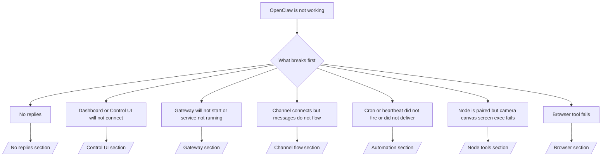

---
read_when:
    - OpenClaw 無法運作，而你需要最快的修復途徑
    - 你需要一個在深入執行手冊前使用的分流流程
summary: OpenClaw 的症狀優先疑難排解中心
title: 一般疑難排解
x-i18n:
    generated_at: "2026-06-27T19:25:46Z"
    model: gpt-5.5
    postprocess_version: locale-links-v1
    provider: openai
    source_hash: ae1236c73e3a5c9237bd81d603e8dca18c595a8bcbb71f5931bfbf2389b342cd
    source_path: help/troubleshooting.md
    workflow: 16
---

如果你只有 2 分鐘，請把這個頁面當作分流入口。

## 前 60 秒

依序執行這個確切階梯：

```bash
openclaw status
openclaw status --all
openclaw gateway probe
openclaw gateway status
openclaw doctor
openclaw channels status --probe
openclaw logs --follow
```

良好輸出的一行摘要：

- `openclaw status` → 顯示已設定的頻道，且沒有明顯的驗證錯誤。
- `openclaw status --all` → 完整報告存在且可分享。
- `openclaw gateway probe` → 預期的閘道目標可連線（`Reachable: yes`）。`Capability: ...` 會告訴你探測可證明的驗證層級，而 `Read probe: limited - missing scope: operator.read` 是診斷降級，不是連線失敗。
- `openclaw gateway status` → `Runtime: running`、`Connectivity probe: ok`，以及合理的 `Capability: ...` 行。如果你也需要讀取範圍的 RPC 證明，請使用 `--require-rpc`。
- `openclaw doctor` → 沒有阻塞性的設定/服務錯誤。
- `openclaw channels status --probe` → 可連線的閘道會回傳即時的各帳號
  傳輸狀態，以及像 `works` 或 `audit ok` 這類探測/稽核結果；如果
  閘道無法連線，命令會退回只含設定的摘要。
- `openclaw logs --follow` → 活動穩定，沒有重複的致命錯誤。

## 助理感覺受限或缺少工具

如果助理無法檢查檔案、執行命令、使用瀏覽器自動化，或
看不到預期工具，請先檢查實際生效的工具設定檔：

```bash
openclaw status
openclaw status --all
openclaw doctor
```

常見原因：

- `tools.profile: "messaging"` 對純聊天代理有意保持狹窄。
- `tools.profile: "coding"` 是用於儲存庫、檔案、shell，
  以及執行階段工作流程的常用設定檔。
- `tools.profile: "full"` 會暴露最廣泛的工具集，應限制在
  受信任且由操作者控制的代理。
- 每個代理的 `agents.list[].tools` 覆寫，可以針對單一代理縮小或擴大根
  設定檔。

變更根層或每個代理的工具設定檔，然後重新啟動或重新載入閘道，
並再次執行 `openclaw status --all`。請參閱 [工具](/zh-TW/tools) 了解設定檔
模型與允許/拒絕覆寫。

## Anthropic 長上下文 429

如果你看到：
`HTTP 429: rate_limit_error: Extra usage is required for long context requests`，
請前往 [/gateway/troubleshooting#anthropic-429-extra-usage-required-for-long-context](/zh-TW/gateway/troubleshooting#anthropic-429-extra-usage-required-for-long-context)。

## 本機 OpenAI 相容後端可直接運作，但在 OpenClaw 中失敗

如果你的本機或自架 `/v1` 後端能回應小型直接
`/v1/chat/completions` 探測，但在 `openclaw infer model run` 或一般
代理回合中失敗：

1. 如果錯誤提到 `messages[].content` 預期為字串，請設定
   `models.providers.<provider>.models[].compat.requiresStringContent: true`。
2. 如果後端仍只在 OpenClaw 代理回合中失敗，請設定
   `models.providers.<provider>.models[].compat.supportsTools: false`，然後重試。
3. 如果很小的直接呼叫仍可運作，但較大的 OpenClaw 提示會讓
   後端當機，請把剩餘問題視為上游模型/伺服器限制，並
   繼續查看深入執行手冊：
   [/gateway/troubleshooting#local-openai-compatible-backend-passes-direct-probes-but-agent-runs-fail](/zh-TW/gateway/troubleshooting#local-openai-compatible-backend-passes-direct-probes-but-agent-runs-fail)

## 外掛安裝因缺少 openclaw extensions 而失敗

如果安裝失敗並出現 `package.json missing openclaw.extensions`，表示該外掛套件
正在使用 OpenClaw 已不再接受的舊格式。

在外掛套件中修正：

1. 將 `openclaw.extensions` 加入 `package.json`。
2. 將項目指向已建置的執行階段檔案（通常是 `./dist/index.js`）。
3. 重新發布外掛，並再次執行 `openclaw plugins install <package>`。

範例：

```json
{
  "name": "@openclaw/my-plugin",
  "version": "1.2.3",
  "openclaw": {
    "extensions": ["./dist/index.js"]
  }
}
```

參考：[外掛架構](/zh-TW/plugins/architecture)

## 安裝政策阻擋外掛安裝或更新

如果更新完成但外掛過期、遭停用，或顯示像
`blocked by install policy`、`install policy failed closed`，或
`Disabled "<plugin>" after plugin update failure` 這類訊息，請檢查
`security.installPolicy`。

安裝政策會在外掛安裝與更新時執行。OpenClaw 擁有的外掛
版本通常會隨 OpenClaw 發行版移動，因此 OpenClaw 更新
也可能需要在更新後同步期間進行相符的 `@openclaw/*` 外掛更新。

除非你也維護相符的升級規則，否則請避免這些寬泛的政策形狀：

- 將 OpenClaw 擁有的外掛凍結在某個確切舊版本，例如只允許
  `@openclaw/*@2026.5.3`。
- 只依來源種類封鎖，例如每個 npm、網路，或
  `request.mode: "update"` 外掛請求。
- 將政策命令視為可選。當 `security.installPolicy` 啟用時，
  缺少、緩慢、無法讀取，或權限遭阻擋的政策可執行檔
  會以封閉方式失敗。
- 核准外掛版本時，未考慮政策請求的
  `openclawVersion` 與外掛候選中繼資料。

較安全的政策規則會在候選項目與目前 OpenClaw 主機相容時，
允許受信任的 OpenClaw 擁有外掛更新，而不是永遠釘選單一
發行版。如果你預設封鎖 npm，請針對你使用的受信任
`@openclaw/*` 外掛套件或外掛 id 建立狹窄例外。如果你
區分安裝與更新請求，請將同一個信任規則套用到
`request.mode: "update"`。

復原：

```bash
openclaw doctor --deep
openclaw plugins update --all
openclaw status --all
```

如果政策有意保持嚴格，請在受信任的 OpenClaw 升級
窗口中放寬它，重新執行 `openclaw plugins update --all`，然後恢復較嚴格的規則。
如果外掛在更新失敗後遭停用，請檢查它，並且只有在更新成功後
才重新啟用：

```bash
openclaw plugins inspect <plugin-id> --runtime --json
openclaw plugins enable <plugin-id>
```

參考：[操作者安裝政策](/zh-TW/tools/skills-config#operator-install-policy-securityinstallpolicy)

## 外掛存在但因可疑擁有權遭阻擋

如果 `openclaw doctor`、設定或啟動警告顯示：

```text
blocked plugin candidate: suspicious ownership (... uid=1000, expected uid=0 or root)
plugin present but blocked
```

表示外掛檔案的擁有者，與載入它們的程序所屬 Unix 使用者不同。
不要移除外掛設定。請修正檔案擁有權，或以擁有狀態目錄的
同一位使用者執行 OpenClaw。

Docker 安裝通常以 `node`（uid `1000`）執行。對於預設 Docker
設定，請修復主機繫結掛載：

```bash
sudo chown -R 1000:1000 /path/to/openclaw-config /path/to/openclaw-workspace
openclaw doctor --fix
```

如果你有意以 root 執行 OpenClaw，請改為將受管理外掛根目錄
修復為 root 擁有權：

```bash
sudo chown -R root:root /path/to/openclaw-config/npm
openclaw doctor --fix
```

更深入的文件：

- [外掛路徑擁有權](/zh-TW/tools/plugin#blocked-plugin-path-ownership)
- [Docker 權限](/zh-TW/install/docker#permissions-and-eacces)

## 決策樹



<AccordionGroup>
  <Accordion title="沒有回覆">
    ```bash
    openclaw status
    openclaw gateway status
    openclaw channels status --probe
    openclaw pairing list --channel <channel> [--account <id>]
    openclaw logs --follow
    ```

    良好輸出看起來像：

    - `Runtime: running`
    - `Connectivity probe: ok`
    - `Capability: read-only`、`write-capable`，或 `admin-capable`
    - 你的頻道顯示傳輸已連線，且在支援時，`channels status --probe` 中有 `works` 或 `audit ok`
    - 傳送者顯示為已核准（或 DM 政策為開放/允許清單）

    常見日誌特徵：

    - `drop guild message (mention required` → 提及閘門在 Discord 中阻擋了訊息。
    - `pairing request` → 傳送者未獲核准，正在等待 DM 配對核准。
    - 頻道日誌中的 `blocked` / `allowlist` → 傳送者、聊天室或群組遭篩選。

    深入頁面：

    - [/gateway/troubleshooting#no-replies](/zh-TW/gateway/troubleshooting#no-replies)
    - [/channels/troubleshooting](/zh-TW/channels/troubleshooting)
    - [/channels/pairing](/zh-TW/channels/pairing)

  </Accordion>

  <Accordion title="儀表板或控制介面無法連線">
    ```bash
    openclaw status
    openclaw gateway status
    openclaw logs --follow
    openclaw doctor
    openclaw channels status --probe
    ```

    良好輸出看起來像：

    - `openclaw gateway status` 中顯示 `Dashboard: http://...`
    - `Connectivity probe: ok`
    - `Capability: read-only`、`write-capable`，或 `admin-capable`
    - 日誌中沒有驗證迴圈

    常見日誌特徵：

    - `device identity required` → HTTP/非安全情境無法完成裝置驗證。
    - `origin not allowed` → 瀏覽器 `Origin` 不允許用於控制介面
      閘道目標。
    - `AUTH_TOKEN_MISMATCH` 搭配重試提示（`canRetryWithDeviceToken=true`）→ 可能會自動發生一次受信任的裝置權杖重試。
    - 該快取權杖重試會重用與已配對
      裝置權杖一起儲存的快取範圍集。明確 `deviceToken` / 明確 `scopes` 呼叫者會保留
      它們要求的範圍集。
    - 在非同步 Tailscale Serve 控制介面路徑上，同一個
      `{scope, ip}` 的失敗嘗試會在限制器記錄失敗前被序列化，因此
      第二個並行的錯誤重試可能已經顯示 `retry later`。
    - 來自 localhost
      瀏覽器來源的 `too many failed authentication attempts (retry later)` → 來自同一個 `Origin` 的重複失敗會暫時
      鎖定；另一個 localhost 來源會使用不同的桶。
    - 該重試後仍重複出現 `unauthorized` → 權杖/密碼錯誤、驗證模式不符，或已配對裝置權杖過期。
    - `gateway connect failed:` → 介面指向錯誤的 URL/連接埠，或閘道無法連線。

    深入頁面：

    - [/gateway/troubleshooting#dashboard-control-ui-connectivity](/zh-TW/gateway/troubleshooting#dashboard-control-ui-connectivity)
    - [/web/control-ui](/zh-TW/web/control-ui)
    - [/gateway/authentication](/zh-TW/gateway/authentication)

  </Accordion>

  <Accordion title="閘道無法啟動，或服務已安裝但未執行">
    ```bash
    openclaw status
    openclaw gateway status
    openclaw logs --follow
    openclaw doctor
    openclaw channels status --probe
    ```

    良好輸出看起來像：

    - `Service: ... (loaded)`
    - `Runtime: running`
    - `Connectivity probe: ok`
    - `Capability: read-only`、`write-capable`，或 `admin-capable`

    常見日誌特徵：

    - `Gateway start blocked: set gateway.mode=local` 或 `existing config is missing gateway.mode` → 閘道模式是遠端，或設定檔缺少本機模式戳記且應修復。
    - `refusing to bind gateway ... without auth` → 在沒有有效閘道驗證路徑（權杖/密碼，或已設定的受信任代理）的情況下繫結非 loopback。
    - `another gateway instance is already listening` 或 `EADDRINUSE` → 連接埠已被占用。

    深入頁面：

    - [/gateway/troubleshooting#gateway-service-not-running](/zh-TW/gateway/troubleshooting#gateway-service-not-running)
    - [/gateway/background-process](/zh-TW/gateway/background-process)
    - [/gateway/configuration](/zh-TW/gateway/configuration)

  </Accordion>

  <Accordion title="通道已連線但訊息沒有流動">
    ```bash
    openclaw status
    openclaw gateway status
    openclaw logs --follow
    openclaw doctor
    openclaw channels status --probe
    ```

    良好的輸出看起來像：

    - 通道傳輸已連線。
    - 配對/允許清單檢查通過。
    - 在需要時能偵測到提及。

    常見記錄特徵：

    - `mention required` → 群組提及閘控封鎖了處理。
    - `pairing` / `pending` → 私訊傳送者尚未核准。
    - `not_in_channel`, `missing_scope`, `Forbidden`, `401/403` → 通道權限權杖問題。

    深入頁面：

    - [/gateway/troubleshooting#channel-connected-messages-not-flowing](/zh-TW/gateway/troubleshooting#channel-connected-messages-not-flowing)
    - [/channels/troubleshooting](/zh-TW/channels/troubleshooting)

  </Accordion>

  <Accordion title="排程或心跳偵測未觸發或未送達">
    ```bash
    openclaw status
    openclaw gateway status
    openclaw cron status
    openclaw cron list
    openclaw cron runs --id <jobId> --limit 20
    openclaw logs --follow
    ```

    良好的輸出看起來像：

    - `cron.status` 顯示已啟用並有下一次喚醒。
    - `cron runs` 顯示近期的 `ok` 項目。
    - 心跳偵測已啟用，且不在有效時段之外。

    常見記錄特徵：

    - `cron: scheduler disabled; jobs will not run automatically` → 排程已停用。
    - `heartbeat skipped` 搭配 `reason=quiet-hours` → 在已設定有效時段之外。
    - `heartbeat skipped` 搭配 `reason=empty-heartbeat-file` → `HEARTBEAT.md` 存在，但只包含空白、註解、標題、圍欄，或空檢查清單骨架。
    - `heartbeat skipped` 搭配 `reason=no-tasks-due` → `HEARTBEAT.md` 任務模式已啟用，但尚未有任何任務間隔到期。
    - `heartbeat skipped` 搭配 `reason=alerts-disabled` → 所有心跳偵測可見性皆已停用（`showOk`、`showAlerts` 和 `useIndicator` 全部關閉）。
    - `requests-in-flight` → 主要通道忙碌；心跳偵測喚醒已延後。
    - `unknown accountId` → 心跳偵測送達目標帳號不存在。

    深入頁面：

    - [/gateway/troubleshooting#cron-and-heartbeat-delivery](/zh-TW/gateway/troubleshooting#cron-and-heartbeat-delivery)
    - [/automation/cron-jobs#troubleshooting](/zh-TW/automation/cron-jobs#troubleshooting)
    - [/gateway/heartbeat](/zh-TW/gateway/heartbeat)

  </Accordion>

  <Accordion title="節點已配對但 camera canvas screen exec 工具失敗">
    ```bash
    openclaw status
    openclaw gateway status
    openclaw nodes status
    openclaw nodes describe --node <idOrNameOrIp>
    openclaw logs --follow
    ```

    良好的輸出看起來像：

    - 節點列為已連線，且已針對角色 `node` 配對。
    - 你正在叫用的命令具備對應功能。
    - 工具的權限狀態為已授予。

    常見記錄特徵：

    - `NODE_BACKGROUND_UNAVAILABLE` → 將節點應用程式帶到前景。
    - `*_PERMISSION_REQUIRED` → 作業系統權限遭拒或缺少。
    - `SYSTEM_RUN_DENIED: approval required` → exec 核准待處理。
    - `SYSTEM_RUN_DENIED: allowlist miss` → 命令不在 exec 允許清單上。

    深入頁面：

    - [/gateway/troubleshooting#node-paired-tool-fails](/zh-TW/gateway/troubleshooting#node-paired-tool-fails)
    - [/nodes/troubleshooting](/zh-TW/nodes/troubleshooting)
    - [/tools/exec-approvals](/zh-TW/tools/exec-approvals)

  </Accordion>

  <Accordion title="Exec 突然要求核准">
    ```bash
    openclaw config get tools.exec.host
    openclaw config get tools.exec.security
    openclaw config get tools.exec.ask
    openclaw gateway restart
    ```

    變更內容：

    - 如果未設定 `tools.exec.host`，預設值是 `auto`。
    - 當沙盒執行階段啟用時，`host=auto` 會解析為 `sandbox`，否則解析為 `gateway`。
    - `host=auto` 只負責路由；免提示的「YOLO」行為來自於 gateway/node 上的 `security=full` 加上 `ask=off`。
    - 在 `gateway` 和 `node` 上，未設定的 `tools.exec.security` 預設為 `full`。
    - 未設定的 `tools.exec.ask` 預設為 `off`。
    - 結果：如果你看到核准要求，代表某些主機本機或每個工作階段的政策，已將 exec 收緊到不同於目前預設值。

    還原目前預設的免核准行為：

    ```bash
    openclaw config set tools.exec.host gateway
    openclaw config set tools.exec.security full
    openclaw config set tools.exec.ask off
    openclaw gateway restart
    ```

    較安全的替代方案：

    - 如果你只是想要穩定的主機路由，只設定 `tools.exec.host=gateway`。
    - 如果你想要主機 exec，但仍希望在允許清單未命中時審查，請使用 `security=allowlist` 搭配 `ask=on-miss`。
    - 如果你想讓 `host=auto` 解析回 `sandbox`，請啟用沙盒模式。

    常見記錄特徵：

    - `Approval required.` → 命令正在等待 `/approve ...`。
    - `SYSTEM_RUN_DENIED: approval required` → 節點主機 exec 核准待處理。
    - `exec host=sandbox requires a sandbox runtime for this session` → 隱含/明確選取沙盒，但沙盒模式已關閉。

    深入頁面：

    - [/tools/exec](/zh-TW/tools/exec)
    - [/tools/exec-approvals](/zh-TW/tools/exec-approvals)
    - [/gateway/security#what-the-audit-checks-high-level](/zh-TW/gateway/security#what-the-audit-checks-high-level)

  </Accordion>

  <Accordion title="瀏覽器工具失敗">
    ```bash
    openclaw status
    openclaw gateway status
    openclaw browser status
    openclaw logs --follow
    openclaw doctor
    ```

    良好的輸出看起來像：

    - 瀏覽器狀態顯示 `running: true`，以及已選擇的瀏覽器/設定檔。
    - `openclaw` 會啟動，或 `user` 可以看到本機 Chrome 分頁。

    常見記錄特徵：

    - `unknown command "browser"` 或 `unknown command 'browser'` → 已設定 `plugins.allow`，且未包含 `browser`。
    - `Failed to start Chrome CDP on port` → 本機瀏覽器啟動失敗。
    - `browser.executablePath not found` → 已設定的二進位路徑錯誤。
    - `browser.cdpUrl must be http(s) or ws(s)` → 已設定的 CDP URL 使用不支援的配置。
    - `browser.cdpUrl has invalid port` → 已設定的 CDP URL 有錯誤或超出範圍的連接埠。
    - `No Chrome tabs found for profile="user"` → Chrome MCP 附加設定檔沒有開啟的本機 Chrome 分頁。
    - `Remote CDP for profile "<name>" is not reachable` → 已設定的遠端 CDP 端點無法從此主機連線。
    - `Browser attachOnly is enabled ... not reachable` 或 `Browser attachOnly is enabled and CDP websocket ... is not reachable` → 僅附加設定檔沒有即時 CDP 目標。
    - 僅附加或遠端 CDP 設定檔上的過期檢視區/深色模式/地區設定/離線覆寫 → 執行 `openclaw browser stop --browser-profile <name>`，即可在不重新啟動閘道的情況下關閉有效控制工作階段並釋放模擬狀態。

    深入頁面：

    - [/gateway/troubleshooting#browser-tool-fails](/zh-TW/gateway/troubleshooting#browser-tool-fails)
    - [/tools/browser#missing-browser-command-or-tool](/zh-TW/tools/browser#missing-browser-command-or-tool)
    - [/tools/browser-linux-troubleshooting](/zh-TW/tools/browser-linux-troubleshooting)
    - [/tools/browser-wsl2-windows-remote-cdp-troubleshooting](/zh-TW/tools/browser-wsl2-windows-remote-cdp-troubleshooting)

  </Accordion>

</AccordionGroup>

## 相關內容

- [常見問題](/zh-TW/help/faq) — 常見問題
- [閘道疑難排解](/zh-TW/gateway/troubleshooting) — 閘道專屬問題
- [診斷](/zh-TW/gateway/doctor) — 自動化健康檢查與修復
- [通道疑難排解](/zh-TW/channels/troubleshooting) — 通道連線問題
- [自動化疑難排解](/zh-TW/automation/cron-jobs#troubleshooting) — 排程與心跳偵測問題
