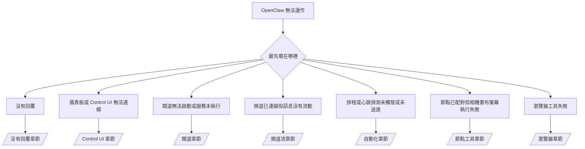

---
read_when:
    - OpenClaw 無法運作，而你需要最快的修復途徑
    - 在深入詳細執行手冊之前，您需要一套分流流程
summary: 以症狀為先的 OpenClaw 疑難排解中心
title: 一般疑難排解
x-i18n:
    generated_at: "2026-07-05T11:28:46Z"
    model: gpt-5.5
    postprocess_version: locale-links-v1
    provider: openai
    source_hash: db50e0cdf4d11f3aa6196be445358d904a2b9c40c89243f1b124c77167f6dd85
    source_path: help/troubleshooting.md
    workflow: 16
---

分流前門。2 分鐘完成診斷，然後跳到深入頁面。

## 前 60 秒

依序執行這個階梯：

```bash
openclaw status
openclaw status --all
openclaw gateway probe
openclaw gateway status
openclaw doctor
openclaw channels status --probe
openclaw logs --follow
```

良好輸出，每項一行：

- `openclaw status` 顯示已設定的頻道，且沒有驗證錯誤。
- `openclaw status --all` 產生完整、可分享的報告。
- `openclaw gateway probe` 顯示 `Reachable: yes`。`Capability: ...` 是探測已證明的
  驗證層級；`Read probe: limited - missing scope:
operator.read` 是降級診斷，不是連線失敗。
- `openclaw gateway status` 顯示 `Runtime: running`、`Connectivity probe:
ok`，以及合理的 `Capability: ...`。加入 `--require-rpc` 也要求
  讀取範圍 RPC 證明。
- `openclaw doctor` 回報沒有阻斷性的設定/服務錯誤。
- `openclaw channels status --probe` 會在閘道可連線時傳回即時的每帳號傳輸狀態
  （`works` / `audit ok`）；無法連線時則退回
  僅設定摘要。
- `openclaw logs --follow` 顯示穩定活動，沒有重複的致命錯誤。

## 助理感覺受限或缺少工具

檢查有效工具設定檔：

```bash
openclaw status
openclaw status --all
openclaw doctor
```

常見原因：

- `tools.profile: "minimal"` 只允許 `session_status`。
- `tools.profile: "messaging"` 範圍很窄，適用於僅聊天的代理。
- `tools.profile: "coding"` 是新的本機設定預設值（repo、檔案、
  shell 與執行階段工作）。
- `tools.profile: "full"` 會移除設定檔限制；僅限受信任的
  操作者控制代理使用。
- 每代理的 `agents.list[].tools` 覆寫會針對單一代理縮窄或擴展根設定檔。

變更設定檔、重新啟動或重新載入閘道，然後用
`openclaw status --all` 重新檢查。完整設定檔/群組表：[工具設定檔](/zh-TW/gateway/config-tools#tool-profiles)。

## Anthropic 長上下文 429

`HTTP 429: rate_limit_error: Extra usage is required for long context requests`
→ [Anthropic 429 長上下文需要額外用量](/zh-TW/gateway/troubleshooting#anthropic-429-extra-usage-required-for-long-context)。

## 本機 OpenAI 相容後端直接使用可運作，但在 OpenClaw 中失敗

你的本機/自架 `/v1` 後端會回應直接的 `/v1/chat/completions`
探測，但在 `openclaw infer model run` 或一般代理回合中失敗：

1. 錯誤提到 `messages[].content` 預期為字串：設定
   `models.providers.<provider>.models[].compat.requiresStringContent: true`。
2. 仍然只在 OpenClaw 代理回合失敗：設定
   `models.providers.<provider>.models[].compat.supportsTools: false` 並重試。
3. 微小的直接呼叫可運作，但較大的 OpenClaw 提示會讓後端當機：那是
   上游模型/伺服器限制，不是 OpenClaw 錯誤。繼續閱讀
   [本機 OpenAI 相容後端通過直接探測，但代理執行失敗](/zh-TW/gateway/troubleshooting#local-openai-compatible-backend-passes-direct-probes-but-agent-runs-fail)。

## 外掛安裝因缺少 openclaw extensions 而失敗

`package.json missing openclaw.extensions` 表示外掛套件使用了
OpenClaw 不再接受的形狀。

在外掛套件中修正：

1. 將 `openclaw.extensions` 加到 `package.json`，指向已建置的執行階段
   檔案（通常是 `./dist/index.js`）。
2. 重新發布，然後再次執行 `openclaw plugins install <package>`。

```json
{
  "name": "@openclaw/my-plugin",
  "version": "1.2.3",
  "openclaw": {
    "extensions": ["./dist/index.js"]
  }
}
```

參考：[外掛架構](/zh-TW/plugins/architecture)

## 安裝政策阻擋外掛安裝或更新

更新完成但外掛過期、停用，或顯示 `blocked by install
policy`、`install policy failed closed`，或 `Disabled "<plugin>" after plugin
update failure`：檢查 `security.installPolicy`。

安裝政策會在外掛安裝與更新時執行。`@openclaw/*` 外掛
版本通常會隨 OpenClaw 發行版移動，因此 OpenClaw 更新可能
需要在更新後同步期間進行相符的外掛更新。

避免這些政策形狀，除非你也維護相符的升級規則：

- 將 OpenClaw 擁有的外掛凍結在某個精確舊版本（例如，只允許
  `@openclaw/*@2026.5.3`）。
- 只依來源種類封鎖（每個 npm、network 或 `request.mode:
"update"` 請求）。
- 將政策命令視為選用：啟用 `security.installPolicy` 時，
  缺少、緩慢、不可讀或被權限阻擋的政策
  可執行檔會以失敗關閉。
- 核准版本時未根據外掛候選中繼資料檢查請求的 `openclawVersion`。

偏好允許與目前主機相容的受信任 `@openclaw/*` 更新規則，
而不是永久釘選單一發行版。如果你預設封鎖 npm，請
為你使用的外掛 ID 加上窄範圍例外，並將相同的
信任規則套用到 `request.mode: "update"` 和安裝。

復原：

```bash
openclaw doctor --deep
openclaw plugins update --all
openclaw status --all
```

如果政策刻意嚴格，請在受信任升級
窗口期間放寬，重新執行 `openclaw plugins update --all`，然後還原較嚴格的規則。
如果更新失敗停用了外掛，重新啟用前請先檢查：

```bash
openclaw plugins inspect <plugin-id> --runtime --json
openclaw plugins enable <plugin-id>
```

參考：[操作者安裝政策](/zh-TW/tools/skills-config#operator-install-policy-securityinstallpolicy)

## 外掛存在但被可疑擁有權阻擋

`openclaw doctor`、設定或啟動警告顯示：

```text
blocked plugin candidate: suspicious ownership (... uid=1000, expected uid=0 or root)
plugin present but blocked
```

外掛檔案的擁有者與載入它們的程序所屬 Unix 使用者不同。
不要移除外掛設定；請修正檔案擁有權，或以擁有狀態目錄的使用者身分執行
OpenClaw。

Docker 安裝會以 `node`（uid `1000`）執行。修復主機繫結掛載：

```bash
sudo chown -R 1000:1000 /path/to/openclaw-config /path/to/openclaw-workspace
openclaw doctor --fix
```

如果你刻意以 root 執行 OpenClaw，請改為修復受管理的外掛根目錄：

```bash
sudo chown -R root:root /path/to/openclaw-config/npm
openclaw doctor --fix
```

更深入文件：[被阻擋的外掛路徑擁有權](/zh-TW/tools/plugin#blocked-plugin-path-ownership)、[Docker：權限與 EACCES](/zh-TW/install/docker#shell-helpers-optional)

## 決策樹



<AccordionGroup>
  <Accordion title="沒有回覆">
    ```bash
    openclaw status
    openclaw gateway status
    openclaw channels status --probe
    openclaw pairing list --channel <channel> [--account <id>]
    openclaw logs --follow
    ```

    良好輸出：

    - `Runtime: running`
    - `Connectivity probe: ok`
    - `Capability: read-only`、`write-capable` 或 `admin-capable`
    - 頻道顯示傳輸已連線，且在支援處，`channels status --probe` 中有 `works` 或
      `audit ok`
    - 傳送者已核准（或 DM 政策為開放/允許清單）

    日誌特徵：

    - `drop guild message (mention required` → Discord 提及閘門阻擋了訊息。
    - `pairing request` → 傳送者未核准，正在等待 DM 配對核准。
    - 頻道日誌中的 `blocked` / `allowlist` → 傳送者、房間或群組被篩選。

    深入頁面：[沒有回覆](/zh-TW/gateway/troubleshooting#no-replies)、[頻道疑難排解](/zh-TW/channels/troubleshooting)、[配對](/zh-TW/channels/pairing)

  </Accordion>

  <Accordion title="儀表板或 Control UI 無法連線">
    ```bash
    openclaw status
    openclaw gateway status
    openclaw logs --follow
    openclaw doctor
    openclaw channels status --probe
    ```

    良好輸出：

    - `Dashboard: http://...` 顯示於 `openclaw gateway status`
    - `Connectivity probe: ok`
    - `Capability: read-only`、`write-capable` 或 `admin-capable`
    - 日誌中沒有驗證迴圈

    日誌特徵：

    - `device identity required` → HTTP/非安全內容無法完成裝置驗證。
    - `origin not allowed` → 瀏覽器 `Origin` 不允許用於 Control UI 閘道目標。
    - `AUTH_TOKEN_MISMATCH` 搭配 `canRetryWithDeviceToken=true` → 可能會自動發生一次受信任的裝置權杖重試，重用已配對權杖的快取範圍。
    - 此重試後重複 `unauthorized` → 錯誤權杖/密碼、驗證模式不符，或過期的已配對裝置權杖。
    - `too many failed authentication attempts (retry later)` → 來自該瀏覽器 `Origin` 的重複失敗會暫時鎖定；其他 localhost 來源使用獨立桶。請參閱[儀表板/Control UI 連線能力](/zh-TW/gateway/troubleshooting#dashboard-control-ui-connectivity)以了解 Tailscale Serve 並行重試細節。
    - `gateway connect failed:` → UI 指向錯誤的 URL/連接埠，或閘道無法連線。

    深入頁面：[儀表板/Control UI 連線能力](/zh-TW/gateway/troubleshooting#dashboard-control-ui-connectivity)、[Control UI](/zh-TW/web/control-ui)、[驗證](/zh-TW/gateway/authentication)

  </Accordion>

  <Accordion title="閘道無法啟動或服務已安裝但未執行">
    ```bash
    openclaw status
    openclaw gateway status
    openclaw logs --follow
    openclaw doctor
    openclaw channels status --probe
    ```

    良好輸出：

    - `Service: ... (loaded)`
    - `Runtime: running`
    - `Connectivity probe: ok`
    - `Capability: read-only`、`write-capable` 或 `admin-capable`

    日誌特徵：

    - `Gateway start blocked: set gateway.mode=local` 或 `existing config is missing gateway.mode` → 閘道模式為遠端，或設定缺少本機模式戳記且需要修復。
    - `refusing to bind gateway ... without auth` → 沒有有效驗證路徑（權杖/密碼，或已設定的受信任代理）卻綁定非迴路介面。
    - `another gateway instance is already listening` 或 `EADDRINUSE` → 連接埠已被占用。

    深入頁面：[閘道服務未執行](/zh-TW/gateway/troubleshooting#gateway-service-not-running)、[背景程序](/zh-TW/gateway/background-process)、[設定](/zh-TW/gateway/configuration)

  </Accordion>

  <Accordion title="頻道已連線但訊息沒有流動">
    ```bash
    openclaw status
    openclaw gateway status
    openclaw logs --follow
    openclaw doctor
    openclaw channels status --probe
    ```

    良好輸出：

    - 頻道傳輸已連線。
    - 配對/允許清單檢查通過。
    - 在需要時偵測到提及。

    日誌特徵：

    - `mention required` → 群組提及閘門阻擋處理。
    - `pairing` / `pending` → DM 傳送者尚未核准。
    - `not_in_channel`、`missing_scope`、`Forbidden`、`401/403` → 頻道權限權杖問題。

    深入頁面：[頻道已連線，訊息未流動](/zh-TW/gateway/troubleshooting#channel-connected-messages-not-flowing)、[頻道疑難排解](/zh-TW/channels/troubleshooting)

  </Accordion>

  <Accordion title="排程或心跳偵測未觸發或未送達">
    ```bash
    openclaw status
    openclaw gateway status
    openclaw cron status
    openclaw cron list
    openclaw cron runs --id <jobId> --limit 20
    openclaw logs --follow
    ```

    良好輸出：

    - `cron status` 顯示排程器已啟用並有下一次喚醒。
    - `cron runs` 顯示近期 `ok` 項目。
    - 心跳偵測已啟用且在有效時段內。

    日誌特徵：

    - `cron: scheduler disabled; jobs will not run automatically` → cron 已停用。
    - `heartbeat skipped` 原因 `quiet-hours` → 超出已設定的活動時段。
    - `heartbeat skipped` 原因 `empty-heartbeat-file` → `HEARTBEAT.md` 存在，但只包含空白、註解、標題、圍欄，或空檢查清單鷹架。
    - `heartbeat skipped` 原因 `no-tasks-due` → 工作模式已啟用，但尚未到任何工作間隔。
    - `heartbeat skipped` 原因 `alerts-disabled` → `showOk`、`showAlerts` 和 `useIndicator` 全部關閉。
    - `requests-in-flight` → 主要通道忙碌；心跳偵測喚醒已延後。
    - `unknown accountId` → 心跳偵測傳遞目標帳戶不存在。

    深入頁面：[排程和心跳偵測傳遞](/zh-TW/gateway/troubleshooting#cron-and-heartbeat-delivery)、[排程工作：疑難排解](/zh-TW/automation/cron-jobs#troubleshooting)、[心跳偵測](/zh-TW/gateway/heartbeat)

  </Accordion>

  <Accordion title="節點已配對，但工具執行 camera canvas screen exec 失敗">
    ```bash
    openclaw status
    openclaw gateway status
    openclaw nodes status
    openclaw nodes describe --node <idOrNameOrIp>
    openclaw logs --follow
    ```

    良好輸出：

    - 節點列為已連線，且已針對角色 `node` 配對。
    - 你正在叫用的命令具備能力。
    - 工具的權限狀態為已授權。

    日誌特徵：

    - `NODE_BACKGROUND_UNAVAILABLE` → 將節點應用程式帶到前景。
    - `*_PERMISSION_REQUIRED` → 作業系統權限遭拒或缺失。
    - `SYSTEM_RUN_DENIED: approval required` → exec 核准待處理。
    - `SYSTEM_RUN_DENIED: allowlist miss` → 命令不在 exec 允許清單上。

    深入頁面：[節點已配對，工具失敗](/zh-TW/gateway/troubleshooting#node-paired-tool-fails)、[節點疑難排解](/zh-TW/nodes/troubleshooting)、[Exec 核准](/zh-TW/tools/exec-approvals)

  </Accordion>

  <Accordion title="Exec 突然要求核准">
    ```bash
    openclaw config get tools.exec.host
    openclaw config get tools.exec.security
    openclaw config get tools.exec.ask
    openclaw gateway restart
    ```

    變更內容：

    - 未設定的 `tools.exec.host` 預設為 `auto`；當沙箱執行階段啟用時會解析為 `sandbox`，否則解析為 `gateway`。
    - `host=auto` 只負責路由；不提示行為來自閘道/節點上的 `security=full` 加上 `ask=off`。
    - 未設定的 `tools.exec.security` 在 `gateway`/`node` 上預設為 `full`。
    - 未設定的 `tools.exec.ask` 預設為 `off`。
    - 如果你看到核准提示，代表某些主機本機或每個工作階段的政策將 exec 收緊到不同於這些預設值。

    還原目前不需核准的預設值：

    ```bash
    openclaw config set tools.exec.host gateway
    openclaw config set tools.exec.security full
    openclaw config set tools.exec.ask off
    openclaw gateway restart
    ```

    較安全的替代方案：

    - 只設定 `tools.exec.host=gateway`，以取得穩定的主機路由。
    - 使用 `security=allowlist` 搭配 `ask=on-miss`，讓主機 exec 在允許清單未命中時經過審查。
    - 啟用沙箱模式，讓 `host=auto` 解析回 `sandbox`。

    日誌特徵：

    - `Approval required.` → 命令正在等待 `/approve ...`。
    - `SYSTEM_RUN_DENIED: approval required` → 節點主機 exec 核准待處理。
    - `exec host=sandbox requires a sandbox runtime for this session` → 隱含/明確選擇沙箱，但沙箱模式已關閉。

    深入頁面：[Exec](/zh-TW/tools/exec)、[Exec 核准](/zh-TW/tools/exec-approvals)、[安全性：稽核檢查的內容](/zh-TW/gateway/security#what-the-audit-checks-high-level)

  </Accordion>

  <Accordion title="瀏覽器工具失敗">
    ```bash
    openclaw status
    openclaw gateway status
    openclaw browser status
    openclaw logs --follow
    openclaw doctor
    ```

    良好輸出：

    - 瀏覽器狀態顯示 `running: true` 和所選的瀏覽器/設定檔。
    - `openclaw` 設定檔會啟動，或 `user` 設定檔可看到本機 Chrome 分頁。

    日誌特徵：

    - `unknown command "browser"` → `plugins.allow` 已設定且排除 `browser`。
    - `Failed to start Chrome CDP on port` → 本機瀏覽器啟動失敗。
    - `browser.executablePath not found` → 已設定的二進位檔路徑錯誤。
    - `browser.cdpUrl must be http(s) or ws(s)` → 已設定的 CDP URL 使用不支援的配置。
    - `browser.cdpUrl has invalid port` → 已設定的 CDP URL 有錯誤或超出範圍的連接埠。
    - `No Chrome tabs found for profile="user"` → Chrome MCP 附加設定檔沒有開啟的本機 Chrome 分頁。
    - `Remote CDP for profile "<name>" is not reachable` → 此主機無法連線到已設定的遠端 CDP 端點。
    - `Browser attachOnly is enabled ... not reachable` → 僅附加設定檔沒有即時 CDP 目標。
    - 僅附加或遠端 CDP 設定檔上的過期視埠/深色模式/地區設定/離線覆寫 → 執行 `openclaw browser stop --browser-profile <name>` 關閉控制工作階段並釋放模擬狀態，不必重新啟動閘道。

    深入頁面：[瀏覽器工具失敗](/zh-TW/gateway/troubleshooting#browser-tool-fails)、[缺少瀏覽器命令或工具](/zh-TW/tools/browser#missing-browser-command-or-tool)、[瀏覽器：Linux 疑難排解](/zh-TW/tools/browser-linux-troubleshooting)、[瀏覽器：WSL2/Windows 遠端 CDP 疑難排解](/zh-TW/tools/browser-wsl2-windows-remote-cdp-troubleshooting)

  </Accordion>

</AccordionGroup>

## 相關

- [常見問題](/zh-TW/help/faq) — 常見問題
- [閘道疑難排解](/zh-TW/gateway/troubleshooting) — 閘道特定問題
- [Doctor](/zh-TW/gateway/doctor) — 自動化健康檢查與修復
- [頻道疑難排解](/zh-TW/channels/troubleshooting) — 頻道連線問題
- [排程工作：疑難排解](/zh-TW/automation/cron-jobs#troubleshooting) — cron 和心跳偵測問題
