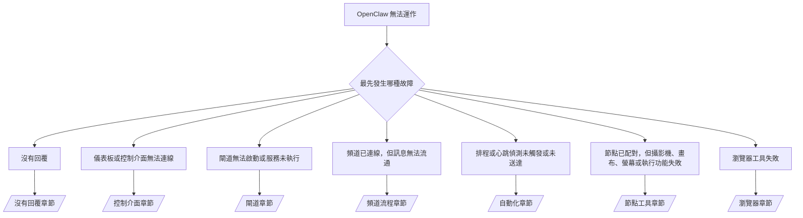

---
read_when:
    - OpenClaw 無法正常運作，而你需要以最快的方式修復問題
    - 你希望在深入查閱詳細的操作手冊之前，先進行問題分類處理流程
summary: 以症狀為優先的 OpenClaw 疑難排解中心
title: 一般疑難排解
x-i18n:
    generated_at: "2026-07-11T21:27:14Z"
    model: gpt-5.6
    postprocess_version: locale-links-v1
    provider: openai
    source_hash: db50e0cdf4d11f3aa6196be445358d904a2b9c40c89243f1b124c77167f6dd85
    source_path: help/troubleshooting.md
    workflow: 16
---

分流入口。2 分鐘內完成診斷，然後跳至深入說明頁面。

## 前 60 秒

依序執行以下階梯式檢查：

```bash
openclaw status
openclaw status --all
openclaw gateway probe
openclaw gateway status
openclaw doctor
openclaw channels status --probe
openclaw logs --follow
```

正常輸出，每項一行：

- `openclaw status` 顯示已設定的頻道，且沒有驗證錯誤。
- `openclaw status --all` 產生完整且可分享的報告。
- `openclaw gateway probe` 顯示 `Reachable: yes`。`Capability: ...` 是探測所證實的驗證層級；`Read probe: limited - missing scope:
operator.read` 代表診斷能力降級，而非連線失敗。
- `openclaw gateway status` 顯示 `Runtime: running`、`Connectivity probe:
ok`，以及合理的 `Capability: ...`。加上 `--require-rpc`，即可同時要求具備讀取範圍的 RPC 證明。
- `openclaw doctor` 未回報會阻礙運作的設定或服務錯誤。
- 當閘道可連線時，`openclaw channels status --probe` 會傳回各帳號的即時傳輸狀態
  （`works` / `audit ok`）；無法連線時，則退回僅依設定產生的摘要。
- `openclaw logs --follow` 顯示穩定活動，且沒有反覆出現的嚴重錯誤。

## 助理能力受限或缺少工具

檢查實際生效的工具設定檔：

```bash
openclaw status
openclaw status --all
openclaw doctor
```

常見原因：

- `tools.profile: "minimal"` 僅允許 `session_status`。
- `tools.profile: "messaging"` 的範圍較窄，適用於僅聊天的代理程式。
- `tools.profile: "coding"` 是新本機設定的預設值（儲存庫、檔案、
  shell 與執行階段工作）。
- `tools.profile: "full"` 會移除設定檔限制；僅限由受信任操作員控制的代理程式使用。
- 每個代理程式的 `agents.list[].tools` 可覆寫根層級設定檔，為單一代理程式縮小或擴大權限。

變更設定檔後，重新啟動或重新載入閘道，再以
`openclaw status --all` 重新檢查。完整設定檔／群組表格：[工具設定檔](/zh-TW/gateway/config-tools#tool-profiles)。

## Anthropic 長上下文 429

`HTTP 429: rate_limit_error: Extra usage is required for long context requests`
→ [Anthropic 429：長上下文需要額外用量](/zh-TW/gateway/troubleshooting#anthropic-429-extra-usage-required-for-long-context)。

## 本機 OpenAI 相容後端可直接運作，但在 OpenClaw 中失敗

你的本機／自行託管 `/v1` 後端可回應直接的 `/v1/chat/completions`
探測，但執行 `openclaw infer model run` 或一般代理程式回合時失敗：

1. 錯誤提及 `messages[].content` 預期為字串：設定
   `models.providers.<provider>.models[].compat.requiresStringContent: true`。
2. 若仍只在 OpenClaw 代理程式回合失敗：設定
   `models.providers.<provider>.models[].compat.supportsTools: false`，然後重試。
3. 小型直接呼叫可運作，但較大的 OpenClaw 提示會使後端崩潰：這是
   上游模型／伺服器限制，不是 OpenClaw 錯誤。請繼續參閱
   [本機 OpenAI 相容後端通過直接探測，但代理程式執行失敗](/zh-TW/gateway/troubleshooting#local-openai-compatible-backend-passes-direct-probes-but-agent-runs-fail)。

## 外掛安裝因缺少 openclaw extensions 而失敗

`package.json missing openclaw.extensions` 表示外掛套件使用了
OpenClaw 已不再接受的結構。

請在外掛套件中修正：

1. 在 `package.json` 加入 `openclaw.extensions`，並指向建置後的執行階段
   檔案（通常是 `./dist/index.js`）。
2. 重新發布，然後再次執行 `openclaw plugins install <package>`。

```json
{
  "name": "@openclaw/my-plugin",
  "version": "1.2.3",
  "openclaw": {
    "extensions": ["./dist/index.js"]
  }
}
```

參考資料：[外掛架構](/zh-TW/plugins/architecture)

## 安裝原則封鎖外掛安裝或更新

更新已完成，但外掛仍過時、遭停用，或顯示 `blocked by install
policy`、`install policy failed closed`，或 `Disabled "<plugin>" after plugin
update failure`：請檢查 `security.installPolicy`。

安裝原則會在外掛安裝與更新時執行。`@openclaw/*` 外掛
版本通常會隨 OpenClaw 版本一起變更，因此 OpenClaw 更新可能
需要在更新後同步期間執行相符的外掛更新。

除非你也維護相符的升級規則，否則請避免使用以下原則形式：

- 將 OpenClaw 所有的外掛凍結在某個確切的舊版本（例如僅允許
  `@openclaw/*@2026.5.3`）。
- 僅依來源類型封鎖（所有 npm、網路或 `request.mode:
"update"` 要求）。
- 將原則命令視為選用：啟用 `security.installPolicy` 時，
  若原則執行檔缺失、執行過慢、無法讀取或因權限遭封鎖，
  將採取失敗即封鎖的方式。
- 核准版本時，未將要求中的 `openclawVersion` 與
  外掛候選項目的中繼資料進行比對。

建議使用允許受信任 `@openclaw/*` 更新且與目前主機相容的規則，
而非永久固定在單一版本。如果你預設封鎖 npm，
請為所使用的外掛 ID 加入範圍明確的例外，並對 `request.mode: "update"`
套用與安裝相同的信任規則。

復原方式：

```bash
openclaw doctor --deep
openclaw plugins update --all
openclaw status --all
```

如果原則刻意設為嚴格，請在受信任的升級時段內放寬原則，
重新執行 `openclaw plugins update --all`，然後恢復較嚴格的規則。
如果更新失敗導致外掛遭停用，請先檢查再重新啟用：

```bash
openclaw plugins inspect <plugin-id> --runtime --json
openclaw plugins enable <plugin-id>
```

參考資料：[操作員安裝原則](/zh-TW/tools/skills-config#operator-install-policy-securityinstallpolicy)

## 外掛存在，但因可疑的擁有權而遭封鎖

`openclaw doctor`、設定或啟動警告顯示：

```text
blocked plugin candidate: suspicious ownership (... uid=1000, expected uid=0 or root)
plugin present but blocked
```

外掛檔案由與載入它們的程序不同的 Unix 使用者擁有。
請勿移除外掛設定；請修正檔案擁有權，或以狀態目錄擁有者的身分
執行 OpenClaw。

Docker 安裝以 `node`（uid `1000`）執行。請修復主機的繫結掛載：

```bash
sudo chown -R 1000:1000 /path/to/openclaw-config /path/to/openclaw-workspace
openclaw doctor --fix
```

如果你刻意以 root 身分執行 OpenClaw，請改為修復受管理的外掛根目錄：

```bash
sudo chown -R root:root /path/to/openclaw-config/npm
openclaw doctor --fix
```

深入文件：[遭封鎖的外掛路徑擁有權](/zh-TW/tools/plugin#blocked-plugin-path-ownership)、[Docker：權限與 EACCES](/zh-TW/install/docker#shell-helpers-optional)

## 決策樹



<AccordionGroup>
  <Accordion title="沒有回覆">
    ```bash
    openclaw status
    openclaw gateway status
    openclaw channels status --probe
    openclaw pairing list --channel <channel> [--account <id>]
    openclaw logs --follow
    ```

    正常輸出：

    - `Runtime: running`
    - `Connectivity probe: ok`
    - `Capability: read-only`、`write-capable` 或 `admin-capable`
    - 頻道顯示傳輸已連線；若支援，`channels status --probe` 中會顯示 `works` 或
      `audit ok`
    - 傳送者已獲核准（或私訊原則設為開放／允許清單）

    日誌特徵：

    - `drop guild message (mention required` → Discord 提及閘門封鎖了訊息。
    - `pairing request` → 傳送者尚未獲核准，正在等待私訊配對核准。
    - 頻道日誌中的 `blocked` / `allowlist` → 傳送者、聊天室或群組遭到篩除。

    深入頁面：[沒有回覆](/zh-TW/gateway/troubleshooting#no-replies)、[頻道疑難排解](/zh-TW/channels/troubleshooting)、[配對](/zh-TW/channels/pairing)

  </Accordion>

  <Accordion title="儀表板或控制介面無法連線">
    ```bash
    openclaw status
    openclaw gateway status
    openclaw logs --follow
    openclaw doctor
    openclaw channels status --probe
    ```

    正常輸出：

    - `openclaw gateway status` 中顯示 `Dashboard: http://...`
    - `Connectivity probe: ok`
    - `Capability: read-only`、`write-capable` 或 `admin-capable`
    - 日誌中沒有驗證迴圈

    日誌特徵：

    - `device identity required` → HTTP／非安全內容無法完成裝置驗證。
    - `origin not allowed` → 控制介面閘道目標不允許瀏覽器的 `Origin`。
    - `AUTH_TOKEN_MISMATCH` 搭配 `canRetryWithDeviceToken=true` → 可能會自動使用受信任裝置權杖重試一次，並重複使用已配對權杖的快取範圍。
    - 重試後仍反覆出現 `unauthorized` → 權杖／密碼錯誤、驗證模式不符，或已配對的裝置權杖過期。
    - `too many failed authentication attempts (retry later)` → 來自該瀏覽器 `Origin` 的重複失敗暫時遭到鎖定；其他 localhost 來源使用個別的計數桶。關於 Tailscale Serve 並行重試的細節，請參閱[儀表板／控制介面連線能力](/zh-TW/gateway/troubleshooting#dashboard-control-ui-connectivity)。
    - `gateway connect failed:` → 介面指向錯誤的 URL／連接埠，或無法連線至閘道。

    深入頁面：[儀表板／控制介面連線能力](/zh-TW/gateway/troubleshooting#dashboard-control-ui-connectivity)、[控制介面](/zh-TW/web/control-ui)、[驗證](/zh-TW/gateway/authentication)

  </Accordion>

  <Accordion title="閘道無法啟動，或服務已安裝但未執行">
    ```bash
    openclaw status
    openclaw gateway status
    openclaw logs --follow
    openclaw doctor
    openclaw channels status --probe
    ```

    正常輸出：

    - `Service: ... (loaded)`
    - `Runtime: running`
    - `Connectivity probe: ok`
    - `Capability: read-only`、`write-capable` 或 `admin-capable`

    日誌特徵：

    - `Gateway start blocked: set gateway.mode=local` 或 `existing config is missing gateway.mode` → 閘道模式為遠端，或設定缺少本機模式標記，需要修復。
    - `refusing to bind gateway ... without auth` → 在沒有有效驗證路徑的情況下繫結至非 local loopback 位址（權杖／密碼，或已設定的受信任 Proxy）。
    - `another gateway instance is already listening` 或 `EADDRINUSE` → 連接埠已遭占用。

    深入頁面：[閘道服務未執行](/zh-TW/gateway/troubleshooting#gateway-service-not-running)、[背景程序](/zh-TW/gateway/background-process)、[設定](/zh-TW/gateway/configuration)

  </Accordion>

  <Accordion title="頻道已連線，但訊息無法流通">
    ```bash
    openclaw status
    openclaw gateway status
    openclaw logs --follow
    openclaw doctor
    openclaw channels status --probe
    ```

    正常輸出：

    - 頻道傳輸已連線。
    - 通過配對／允許清單檢查。
    - 在需要提及時，能偵測到提及。

    日誌特徵：

    - `mention required` → 群組提及閘門封鎖了處理。
    - `pairing` / `pending` → 私訊傳送者尚未獲核准。
    - `not_in_channel`、`missing_scope`、`Forbidden`、`401/403` → 頻道權限權杖問題。

    深入頁面：[頻道已連線但訊息未流通](/zh-TW/gateway/troubleshooting#channel-connected-messages-not-flowing)、[頻道疑難排解](/zh-TW/channels/troubleshooting)

  </Accordion>

  <Accordion title="排程或心跳偵測未觸發或未送達">
    ```bash
    openclaw status
    openclaw gateway status
    openclaw cron status
    openclaw cron list
    openclaw cron runs --id <jobId> --limit 20
    openclaw logs --follow
    ```

    正常輸出：

    - `cron status` 顯示排程器已啟用，並有下一次喚醒時間。
    - `cron runs` 顯示近期的 `ok` 項目。
    - 心跳偵測已啟用，且目前位於活動時段內。

    日誌特徵：

    - `cron: scheduler disabled; jobs will not run automatically` → 排程已停用。
    - `heartbeat skipped` 原因為 `quiet-hours` → 不在設定的活動時段內。
    - `heartbeat skipped` 原因為 `empty-heartbeat-file` → `HEARTBEAT.md` 存在，但僅包含空白、註解、標題、圍欄或空白檢查清單的框架。
    - `heartbeat skipped` 原因為 `no-tasks-due` → 任務模式已啟用，但尚未有任何任務間隔到期。
    - `heartbeat skipped` 原因為 `alerts-disabled` → `showOk`、`showAlerts` 和 `useIndicator` 均已關閉。
    - `requests-in-flight` → 主要通道忙碌中；心跳偵測喚醒已延後。
    - `unknown accountId` → 心跳偵測傳遞目標帳戶不存在。

    深入閱讀：[排程與心跳偵測傳遞](/zh-TW/gateway/troubleshooting#cron-and-heartbeat-delivery)、[排程任務：疑難排解](/zh-TW/automation/cron-jobs#troubleshooting)、[心跳偵測](/zh-TW/gateway/heartbeat)

  </Accordion>

  <Accordion title="節點已配對，但相機、畫布、螢幕或執行工具失敗">
    ```bash
    openclaw status
    openclaw gateway status
    openclaw nodes status
    openclaw nodes describe --node <idOrNameOrIp>
    openclaw logs --follow
    ```

    正常輸出：

    - 節點列為已連線，並以 `node` 角色完成配對。
    - 您正在叫用的命令具備相應功能。
    - 該工具的權限狀態為已授予。

    記錄特徵：

    - `NODE_BACKGROUND_UNAVAILABLE` → 將節點應用程式切換至前景。
    - `*_PERMISSION_REQUIRED` → 作業系統權限遭拒或缺失。
    - `SYSTEM_RUN_DENIED: approval required` → 執行核准待處理。
    - `SYSTEM_RUN_DENIED: allowlist miss` → 命令不在執行允許清單中。

    深入閱讀：[節點已配對，但工具失敗](/zh-TW/gateway/troubleshooting#node-paired-tool-fails)、[節點疑難排解](/zh-TW/nodes/troubleshooting)、[執行核准](/zh-TW/tools/exec-approvals)

  </Accordion>

  <Accordion title="執行工具突然要求核准">
    ```bash
    openclaw config get tools.exec.host
    openclaw config get tools.exec.security
    openclaw config get tools.exec.ask
    openclaw gateway restart
    ```

    發生的變更：

    - 未設定的 `tools.exec.host` 預設為 `auto`；沙箱執行階段啟用時會解析為 `sandbox`，否則解析為 `gateway`。
    - `host=auto` 僅負責路由；不顯示提示的行為來自閘道／節點上的 `security=full` 加上 `ask=off`。
    - 在 `gateway`／`node` 上，未設定的 `tools.exec.security` 預設為 `full`。
    - 未設定的 `tools.exec.ask` 預設為 `off`。
    - 如果您看到核准提示，表示某個主機本機或個別工作階段原則已收緊執行規則，使其偏離這些預設值。

    還原目前不需核准的預設值：

    ```bash
    openclaw config set tools.exec.host gateway
    openclaw config set tools.exec.security full
    openclaw config set tools.exec.ask off
    openclaw gateway restart
    ```

    更安全的替代方案：

    - 僅設定 `tools.exec.host=gateway`，以取得穩定的主機路由。
    - 使用 `security=allowlist` 搭配 `ask=on-miss`，讓主機執行在未命中允許清單時需要審查。
    - 啟用沙箱模式，讓 `host=auto` 重新解析為 `sandbox`。

    記錄特徵：

    - `Approval required.` → 命令正在等待 `/approve ...`。
    - `SYSTEM_RUN_DENIED: approval required` → 節點主機執行核准待處理。
    - `exec host=sandbox requires a sandbox runtime for this session` → 已隱含或明確選擇沙箱，但沙箱模式未啟用。

    深入閱讀：[執行工具](/zh-TW/tools/exec)、[執行核准](/zh-TW/tools/exec-approvals)、[安全性：稽核檢查的項目](/zh-TW/gateway/security#what-the-audit-checks-high-level)

  </Accordion>

  <Accordion title="瀏覽器工具失敗">
    ```bash
    openclaw status
    openclaw gateway status
    openclaw browser status
    openclaw logs --follow
    openclaw doctor
    ```

    正常輸出：

    - 瀏覽器狀態顯示 `running: true`，且已選擇瀏覽器／設定檔。
    - `openclaw` 設定檔能夠啟動，或 `user` 設定檔能看到本機 Chrome 分頁。

    記錄特徵：

    - `unknown command "browser"` → 已設定 `plugins.allow`，但其中不包含 `browser`。
    - `Failed to start Chrome CDP on port` → 本機瀏覽器啟動失敗。
    - `browser.executablePath not found` → 設定的二進位檔路徑錯誤。
    - `browser.cdpUrl must be http(s) or ws(s)` → 設定的 CDP URL 使用不支援的配置。
    - `browser.cdpUrl has invalid port` → 設定的 CDP URL 連接埠無效或超出範圍。
    - `No Chrome tabs found for profile="user"` → Chrome MCP 附加設定檔沒有任何開啟中的本機 Chrome 分頁。
    - `Remote CDP for profile "<name>" is not reachable` → 此主機無法連線至設定的遠端 CDP 端點。
    - `Browser attachOnly is enabled ... not reachable` → 僅附加設定檔沒有可用的 CDP 目標。
    - 僅附加或遠端 CDP 設定檔上殘留的檢視區域／深色模式／地區設定／離線覆寫 → 執行 `openclaw browser stop --browser-profile <name>`，即可關閉控制工作階段並釋放模擬狀態，而不必重新啟動閘道。

    深入閱讀：[瀏覽器工具失敗](/zh-TW/gateway/troubleshooting#browser-tool-fails)、[缺少瀏覽器命令或工具](/zh-TW/tools/browser#missing-browser-command-or-tool)、[瀏覽器：Linux 疑難排解](/zh-TW/tools/browser-linux-troubleshooting)、[瀏覽器：WSL2／Windows 遠端 CDP 疑難排解](/zh-TW/tools/browser-wsl2-windows-remote-cdp-troubleshooting)

  </Accordion>

</AccordionGroup>

## 相關內容

- [常見問題](/zh-TW/help/faq) — 常見問答
- [閘道疑難排解](/zh-TW/gateway/troubleshooting) — 閘道特定問題
- [診斷工具](/zh-TW/gateway/doctor) — 自動健康狀態檢查與修復
- [頻道疑難排解](/zh-TW/channels/troubleshooting) — 頻道連線問題
- [排程任務：疑難排解](/zh-TW/automation/cron-jobs#troubleshooting) — 排程與心跳偵測問題
