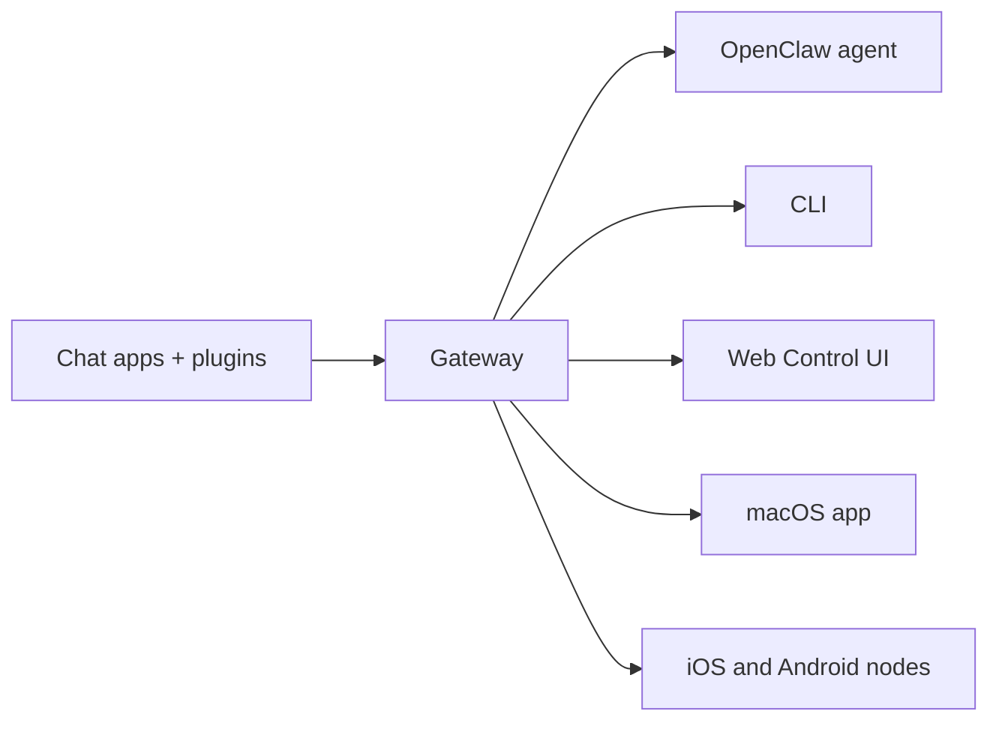

---
read_when:
    - 向新手介紹 OpenClaw
summary: OpenClaw 是可在任何作業系統上執行的 AI agent 多通道閘道。
title: OpenClaw
x-i18n:
    generated_at: "2026-06-27T19:25:38Z"
    model: gpt-5.5
    postprocess_version: locale-links-v1
    provider: openai
    source_hash: fcaa54a0a6d7aa62193fd9f03428bbcbfdcb2c00a184bcd6f49e4e093fefc473
    source_path: index.md
    workflow: 16
---

# OpenClaw 🦞

<p align="center">
    
    
</p>

> _「去角質！去角質！」_ — 可能是一隻太空龍蝦

<p align="center">
  <strong>適用於任何作業系統的 AI 代理閘道，橫跨 Discord、Google Chat、iMessage、Matrix、Microsoft Teams、Signal、Slack、Telegram、WhatsApp、Zalo 等平台。</strong><br />
  傳送一則訊息，就能從口袋取得代理回覆。在內建通道、隨附通道外掛、WebChat 和行動節點之間執行一個閘道。
</p>

<Columns>
  <Card title="開始使用" href="/zh-TW/start/getting-started" icon="rocket">
    安裝 OpenClaw，並在幾分鐘內啟動閘道。
  </Card>
  <Card title="執行入門設定" href="/zh-TW/start/wizard" icon="sparkles">
    透過 `openclaw onboard` 和配對流程進行引導式設定。
  </Card>
  <Card title="開啟控制介面" href="/zh-TW/web/control-ui" icon="layout-dashboard">
    啟動用於聊天、設定和工作階段的瀏覽器儀表板。
  </Card>
</Columns>

## OpenClaw 是什麼？

OpenClaw 是一個**自託管閘道**，可將你喜愛的聊天應用程式與通道介面，包括內建通道，以及 Discord、Google Chat、iMessage、Matrix、Microsoft Teams、Signal、Slack、Telegram、WhatsApp、Zalo 等隨附或外部通道外掛，連接到 AI 程式碼代理。你在自己的機器（或伺服器）上執行單一閘道程序，它就會成為你的訊息應用程式與隨時可用的 AI 助理之間的橋樑。

**適合誰使用？** 想要一個可從任何地方傳訊息聯絡、同時不放棄資料控制權，也不依賴託管服務的個人 AI 助理的開發者與進階使用者。

**它有什麼不同？**

- **自託管**：在你的硬體上執行，遵循你的規則
- **多通道**：一個閘道可同時服務內建通道，以及隨附或外部通道外掛
- **代理原生**：專為具備工具使用、工作階段、記憶和多代理路由的程式碼代理而建
- **開源**：採 MIT 授權，由社群驅動

**你需要什麼？** 節點 24（建議），或節點 22 LTS（`22.19+`）以取得相容性、所選供應商的 API 金鑰，以及 5 分鐘。為了最佳品質與安全性，請使用可用的最強最新世代模型。

## 運作方式



閘道是工作階段、路由和通道連線的單一事實來源。

## 主要能力

<Columns>
  <Card title="多通道閘道" icon="network" href="/zh-TW/channels">
    透過單一閘道程序使用 Discord、iMessage、Signal、Slack、Telegram、WhatsApp、WebChat 等。
  </Card>
  <Card title="外掛通道" icon="plug" href="/zh-TW/tools/plugin">
    隨附外掛會在一般目前版本中加入 Matrix、Nostr、Twitch、Zalo 等。
  </Card>
  <Card title="多代理路由" icon="route" href="/zh-TW/concepts/multi-agent">
    依代理、工作區或傳送者隔離工作階段。
  </Card>
  <Card title="媒體支援" icon="image" href="/zh-TW/nodes/images">
    傳送與接收圖片、音訊和文件。
  </Card>
  <Card title="網頁控制介面" icon="monitor" href="/zh-TW/web/control-ui">
    用於聊天、設定、工作階段和節點的瀏覽器儀表板。
  </Card>
  <Card title="行動節點" icon="smartphone" href="/zh-TW/nodes">
    配對 iOS 和 Android 節點，用於 Canvas、相機和語音啟用的工作流程。
  </Card>
</Columns>

## 快速開始

<Steps>
  <Step title="安裝 OpenClaw">
    ```bash
    npm install -g openclaw@latest
    ```
  </Step>
  <Step title="入門設定並安裝服務">
    ```bash
    openclaw onboard --install-daemon
    ```
  </Step>
  <Step title="聊天">
    在瀏覽器中開啟控制介面並傳送訊息：

    ```bash
    openclaw dashboard
    ```

    或連接一個通道（[Telegram](/zh-TW/channels/telegram) 最快），並從手機聊天。

  </Step>
</Steps>

需要完整安裝與開發設定？請參閱[開始使用](/zh-TW/start/getting-started)。

## 儀表板

閘道啟動後開啟瀏覽器控制介面。

- 本機預設值：[http://127.0.0.1:18789/](http://127.0.0.1:18789/)
- 遠端存取：[網頁介面](/zh-TW/web) 和 [Tailscale](/zh-TW/gateway/tailscale)

<p align="center">
  
</p>

## 設定（選用）

設定位於 `~/.openclaw/openclaw.json`。

- 如果你**什麼都不做**，OpenClaw 會使用隨附的 OpenClaw 代理執行階段，並為每位傳送者建立工作階段。
- 如果你想要鎖定存取權，請從 `channels.whatsapp.allowFrom` 和（群組用的）提及規則開始。

範例：

```json5
{
  channels: {
    whatsapp: {
      allowFrom: ["+15555550123"],
      groups: { "*": { requireMention: true } },
    },
  },
  messages: { groupChat: { mentionPatterns: ["@openclaw"] } },
}
```

## 從這裡開始

<Columns>
  <Card title="文件中心" href="/zh-TW/start/hubs" icon="book-open">
    依使用案例整理的所有文件與指南。
  </Card>
  <Card title="設定" href="/zh-TW/gateway/configuration" icon="settings">
    核心閘道設定、權杖與供應商設定。
  </Card>
  <Card title="遠端存取" href="/zh-TW/gateway/remote" icon="globe">
    SSH 與 tailnet 存取模式。
  </Card>
  <Card title="通道" href="/zh-TW/channels/telegram" icon="message-square">
    Feishu、Microsoft Teams、WhatsApp、Telegram、Discord 等的通道專屬設定。
  </Card>
  <Card title="節點" href="/zh-TW/nodes" icon="smartphone">
    具備配對、Canvas、相機與裝置動作的 iOS 和 Android 節點。
  </Card>
  <Card title="說明" href="/zh-TW/help" icon="life-buoy">
    常見修正與疑難排解入口點。
  </Card>
</Columns>

## 深入了解

<Columns>
  <Card title="完整功能清單" href="/zh-TW/concepts/features" icon="list">
    完整的通道、路由與媒體能力。
  </Card>
  <Card title="多代理路由" href="/zh-TW/concepts/multi-agent" icon="route">
    工作區隔離與每代理工作階段。
  </Card>
  <Card title="安全性" href="/zh-TW/gateway/security" icon="shield">
    權杖、允許清單與安全控制。
  </Card>
  <Card title="疑難排解" href="/zh-TW/gateway/troubleshooting" icon="wrench">
    閘道診斷與常見錯誤。
  </Card>
  <Card title="關於與致謝" href="/zh-TW/reference/credits" icon="info">
    專案起源、貢獻者與授權。
  </Card>
</Columns>
