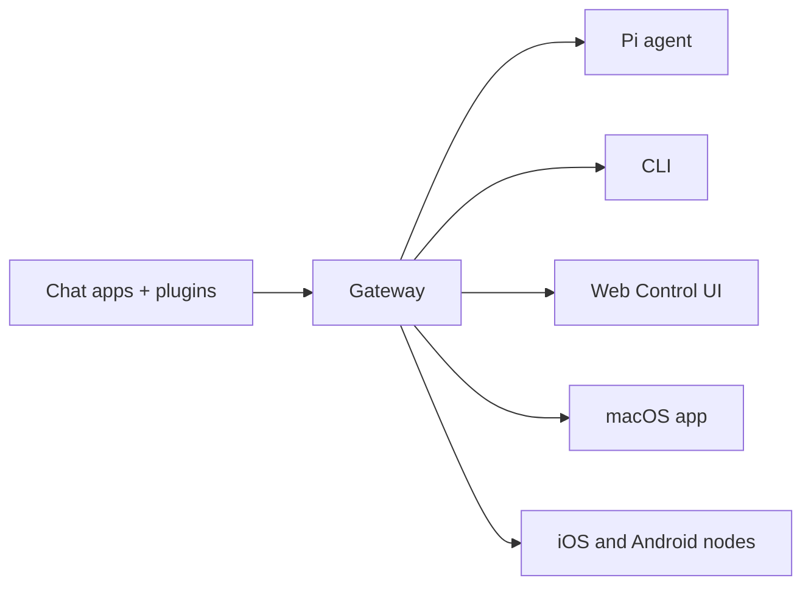

---
read_when:
    - 向新手介紹 OpenClaw
summary: OpenClaw 是一個供 AI 代理使用、可在任何作業系統上執行的多通道 Gateway。
title: OpenClaw
x-i18n:
    generated_at: "2026-04-30T03:12:46Z"
    model: gpt-5.5
    provider: openai
    source_hash: 923d34fa604051d502e4bc902802d6921a4b89a9447f76123aa8d2ff085f0b99
    source_path: index.md
    workflow: 16
---

# OpenClaw 🦞

<p align="center">
    
    
</p>

> _"EXFOLIATE! EXFOLIATE!"_ — 可能是一隻太空龍蝦

<p align="center">
  <strong>適用於任何作業系統的 AI agent Gateway，橫跨 Discord、Google Chat、iMessage、Matrix、Microsoft Teams、Signal、Slack、Telegram、WhatsApp、Zalo 等平台。</strong><br />
  傳送訊息，即可從口袋裡取得 agent 回應。透過一個 Gateway，跨內建頻道、隨附頻道 Plugin、WebChat 和行動節點執行。
</p>

<Columns>
  <Card title="開始使用" href="/zh-TW/start/getting-started" icon="rocket">
    安裝 OpenClaw，幾分鐘內啟動 Gateway。
  </Card>
  <Card title="執行新手導引" href="/zh-TW/start/wizard" icon="sparkles">
    使用 `openclaw onboard` 和配對流程進行引導式設定。
  </Card>
  <Card title="開啟控制 UI" href="/zh-TW/web/control-ui" icon="layout-dashboard">
    啟動瀏覽器儀表板，用於聊天、設定和工作階段。
  </Card>
</Columns>

## 什麼是 OpenClaw？

OpenClaw 是一個**自架 Gateway**，可將你常用的聊天應用程式和頻道介面（包含內建頻道，以及隨附或外部頻道 Plugin，例如 Discord、Google Chat、iMessage、Matrix、Microsoft Teams、Signal、Slack、Telegram、WhatsApp、Zalo 等）連接到像 Pi 這樣的 AI coding agents。你在自己的機器（或伺服器）上執行單一 Gateway 程序，它就會成為你的訊息應用程式與隨時可用的 AI 助理之間的橋樑。

**適合誰使用？** 適合想要一個可從任何地方傳訊息聯絡的個人 AI 助理，同時不想放棄資料控制權或依賴託管服務的開發者和進階使用者。

**它有什麼不同？**

- **自架**：在你的硬體上執行，依你的規則運作
- **多頻道**：一個 Gateway 可同時服務內建頻道，以及隨附或外部頻道 Plugin
- **Agent 原生**：專為具備工具使用、工作階段、記憶體和多 agent 路由的 coding agents 建置
- **開放原始碼**：採用 MIT 授權，由社群驅動

**你需要什麼？** Node 24（建議），或相容用的 Node 22 LTS (`22.14+`)、你所選提供者的 API 金鑰，以及 5 分鐘。為了最佳品質和安全性，請使用可用的最強最新世代模型。

## 運作方式



Gateway 是工作階段、路由和頻道連線的單一事實來源。

## 主要功能

<Columns>
  <Card title="多頻道 Gateway" icon="network" href="/zh-TW/channels">
    透過單一 Gateway 程序使用 Discord、iMessage、Signal、Slack、Telegram、WhatsApp、WebChat 等。
  </Card>
  <Card title="Plugin 頻道" icon="plug" href="/zh-TW/tools/plugin">
    在一般目前版本中，隨附 Plugin 可加入 Matrix、Nostr、Twitch、Zalo 等。
  </Card>
  <Card title="多 agent 路由" icon="route" href="/zh-TW/concepts/multi-agent">
    依每個 agent、工作區或傳送者隔離工作階段。
  </Card>
  <Card title="媒體支援" icon="image" href="/zh-TW/nodes/images">
    傳送和接收圖片、音訊與文件。
  </Card>
  <Card title="Web 控制 UI" icon="monitor" href="/zh-TW/web/control-ui">
    用於聊天、設定、工作階段和節點的瀏覽器儀表板。
  </Card>
  <Card title="行動節點" icon="smartphone" href="/zh-TW/nodes">
    配對 iOS 和 Android 節點，用於 Canvas、相機和語音啟用的工作流程。
  </Card>
</Columns>

## 快速開始

<Steps>
  <Step title="安裝 OpenClaw">
    ```bash
    npm install -g openclaw@latest
    ```
  </Step>
  <Step title="新手導引並安裝服務">
    ```bash
    openclaw onboard --install-daemon
    ```
  </Step>
  <Step title="聊天">
    在瀏覽器中開啟控制 UI 並傳送訊息：

    ```bash
    openclaw dashboard
    ```

    或連接一個頻道（[Telegram](/zh-TW/channels/telegram) 最快），然後從手機聊天。

  </Step>
</Steps>

需要完整安裝和開發設定？請參閱[開始使用](/zh-TW/start/getting-started)。

## 儀表板

Gateway 啟動後，開啟瀏覽器控制 UI。

- 本機預設值：[http://127.0.0.1:18789/](http://127.0.0.1:18789/)
- 遠端存取：[Web 介面](/zh-TW/web)和 [Tailscale](/zh-TW/gateway/tailscale)

<p align="center">
  
</p>

## 設定（選用）

設定位於 `~/.openclaw/openclaw.json`。

- 如果你**什麼都不做**，OpenClaw 會使用 RPC 模式中的隨附 Pi 二進位檔，並為每個傳送者建立工作階段。
- 如果你想要鎖定存取，請從 `channels.whatsapp.allowFrom` 和（針對群組）提及規則開始。

範例：

```json5
{
  channels: {
    whatsapp: {
      allowFrom: ["+15555550123"],
      groups: { "*": { requireMention: true } },
    },
  },
  messages: { groupChat: { mentionPatterns: ["@openclaw"] } },
}
```

## 從這裡開始

<Columns>
  <Card title="文件中心" href="/zh-TW/start/hubs" icon="book-open">
    依使用情境整理的所有文件和指南。
  </Card>
  <Card title="設定" href="/zh-TW/gateway/configuration" icon="settings">
    核心 Gateway 設定、權杖和提供者設定。
  </Card>
  <Card title="遠端存取" href="/zh-TW/gateway/remote" icon="globe">
    SSH 和 tailnet 存取模式。
  </Card>
  <Card title="頻道" href="/zh-TW/channels/telegram" icon="message-square">
    Feishu、Microsoft Teams、WhatsApp、Telegram、Discord 等的頻道專屬設定。
  </Card>
  <Card title="節點" href="/zh-TW/nodes" icon="smartphone">
    具備配對、Canvas、相機和裝置動作的 iOS 與 Android 節點。
  </Card>
  <Card title="說明" href="/zh-TW/help" icon="life-buoy">
    常見修正和疑難排解入口。
  </Card>
</Columns>

## 深入了解

<Columns>
  <Card title="完整功能清單" href="/zh-TW/concepts/features" icon="list">
    完整的頻道、路由和媒體功能。
  </Card>
  <Card title="多 agent 路由" href="/zh-TW/concepts/multi-agent" icon="route">
    工作區隔離和每個 agent 的工作階段。
  </Card>
  <Card title="安全性" href="/zh-TW/gateway/security" icon="shield">
    權杖、允許清單和安全控制。
  </Card>
  <Card title="疑難排解" href="/zh-TW/gateway/troubleshooting" icon="wrench">
    Gateway 診斷和常見錯誤。
  </Card>
  <Card title="關於與致謝" href="/zh-TW/reference/credits" icon="info">
    專案起源、貢獻者和授權。
  </Card>
</Columns>
