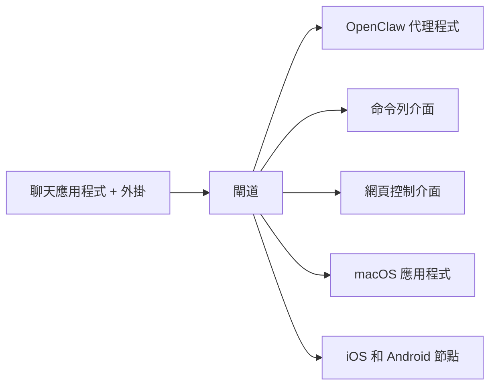

---
read_when:
    - 向新手介紹 OpenClaw
summary: OpenClaw 是可在任何作業系統上執行的 AI 代理多通道閘道。
title: OpenClaw
x-i18n:
    generated_at: "2026-07-11T21:27:07Z"
    model: gpt-5.6
    postprocess_version: locale-links-v1
    provider: openai
    source_hash: 2b87c2a9ce06f110bda45709fb6055ed8000f73993793ea7386db2a47a782828
    source_path: index.md
    workflow: 16
---

# OpenClaw 🦞

<p align="center">
    
    
</p>

> _「去角質！去角質！」_ — 大概是某隻太空龍蝦說的

<p align="center">
  <strong>適用於任何作業系統的 AI 代理程式閘道，支援 Discord、Google Chat、iMessage、Matrix、Microsoft Teams、Signal、Slack、Telegram、WhatsApp、Zalo 等平台。</strong><br />
  傳送訊息，即可隨時從口袋裡取得代理程式的回覆。只需執行一個閘道，即可串連頻道外掛、WebChat 和行動節點。
</p>

<Columns>
  <Card title="開始使用" href="/zh-TW/start/getting-started" icon="rocket">
    安裝 OpenClaw，幾分鐘內即可啟動閘道。
  </Card>
  <Card title="執行初始設定" href="/zh-TW/start/wizard" icon="list-checks">
    使用 `openclaw onboard` 和配對流程進行引導式設定。
  </Card>
  <Card title="連接頻道" href="/zh-TW/channels" icon="message-circle">
    連結 Discord、Signal、Telegram、WhatsApp 等平台，隨時隨地進行聊天。
  </Card>
  <Card title="開啟控制介面" href="/zh-TW/web/control-ui" icon="layout-dashboard">
    啟動瀏覽器儀表板，以管理聊天、設定和工作階段。
  </Card>
</Columns>

## 瀏覽文件

行動版瀏覽器可能只會顯示章節選單，而不會顯示完整的桌面版分頁列。請使用
這些入口連結，從頁面內容前往相同的頂層文件區域。

<Columns>
  <Card title="開始使用" href="/zh-TW" icon="rocket">
    概覽、展示、入門步驟和設定指南。
  </Card>
  <Card title="安裝" href="/zh-TW/install" icon="download">
    安裝方式、更新、容器、託管和進階設定。
  </Card>
  <Card title="頻道" href="/zh-TW/channels" icon="messages-square">
    訊息頻道、配對、路由、存取群組和頻道品質保證。
  </Card>
  <Card title="代理程式" href="/zh-TW/concepts/architecture" icon="bot">
    架構、工作階段、情境、記憶和多代理程式路由。
  </Card>
  <Card title="功能" href="/zh-TW/tools" icon="wand-sparkles">
    工具、Skills、排程、網路鉤子和自動化功能。
  </Card>
  <Card title="ClawHub" href="/zh-TW/clawhub" icon="store">
    外掛市集、發布、策展和信任指南。
  </Card>
  <Card title="模型" href="/zh-TW/providers" icon="brain">
    供應商、模型設定、容錯移轉和本機模型服務。
  </Card>
  <Card title="平台" href="/zh-TW/platforms" icon="monitor-smartphone">
    macOS、Windows、iOS、Android、節點和網頁介面。
  </Card>
  <Card title="閘道與維運" href="/zh-TW/gateway" icon="server">
    閘道設定、安全性、診斷和維運。
  </Card>
  <Card title="參考資料" href="/zh-TW/cli" icon="terminal">
    命令列介面參考、結構描述、RPC、版本資訊和範本。
  </Card>
  <Card title="說明" href="/zh-TW/help" icon="life-buoy">
    疑難排解、常見問題、測試、診斷和環境檢查。
  </Card>
</Columns>

## 什麼是 OpenClaw？

OpenClaw 是一個**自行託管的閘道**，透過頻道外掛將您常用的聊天應用程式（包括 Discord、Google Chat、iMessage、Matrix、Microsoft Teams、Signal、Slack、Telegram、WhatsApp、Zalo 等）連接至 AI 程式設計代理程式。您只需在自己的電腦（或伺服器）上執行單一閘道程序，它便會成為訊息應用程式與隨時可用的 AI 助理之間的橋樑。

**適合哪些人？** 希望能隨時隨地傳訊息給個人 AI 助理，同時不放棄資料控制權或依賴託管服務的開發人員與進階使用者。

**它有何不同？**

- **自行託管**：在您的硬體上執行，由您制定規則
- **多頻道**：一個閘道可同時服務所有已設定的頻道外掛
- **代理程式原生**：專為支援工具使用、工作階段、記憶和多代理程式路由的程式設計代理程式打造
- **開放原始碼**：採用 MIT 授權，由社群推動

**您需要什麼？** Node 24（建議使用），或為了相容性使用 Node 22 LTS（`22.19+`）、所選供應商提供的 API 金鑰，以及 5 分鐘。為獲得最佳品質與安全性，請使用可用的最強最新一代模型。

## 運作方式



閘道是工作階段、路由和頻道連線的唯一真實來源。

## 主要功能

<Columns>
  <Card title="多頻道閘道" icon="network" href="/zh-TW/channels">
    只需一個閘道程序，即可支援 Discord、iMessage、Signal、Slack、Telegram、WhatsApp、WebChat 等平台。
  </Card>
  <Card title="外掛頻道" icon="plug" href="/zh-TW/tools/plugin">
    頻道外掛可新增 Matrix、Nostr、Twitch、Zalo 等平台；官方外掛可隨需安裝。
  </Card>
  <Card title="多代理程式路由" icon="route" href="/zh-TW/concepts/multi-agent">
    依代理程式、工作區或傳送者提供隔離的工作階段。
  </Card>
  <Card title="媒體支援" icon="image" href="/zh-TW/nodes/images">
    傳送及接收圖片、音訊和文件。
  </Card>
  <Card title="網頁控制介面" icon="monitor" href="/zh-TW/web/control-ui">
    用於聊天、設定、工作階段和節點的瀏覽器儀表板。
  </Card>
  <Card title="行動節點" icon="smartphone" href="/zh-TW/nodes">
    配對 iOS 和 Android 節點，以支援 Canvas、相機和語音工作流程。
  </Card>
</Columns>

## 快速開始

<Steps>
  <Step title="安裝 OpenClaw">
    ```bash
    npm install -g openclaw@latest
    ```
  </Step>
  <Step title="完成初始設定並安裝服務">
    ```bash
    openclaw onboard --install-daemon
    ```
  </Step>
  <Step title="聊天">
    在瀏覽器中開啟控制介面並傳送訊息：

    ```bash
    openclaw dashboard
    ```

    或連接頻道（[Telegram](/zh-TW/channels/telegram) 最快），然後從手機開始聊天。

  </Step>
</Steps>

需要完整的安裝與開發環境設定嗎？請參閱[開始使用](/zh-TW/start/getting-started)。

## 儀表板

閘道啟動後，開啟瀏覽器控制介面。

- 本機預設位址：[http://127.0.0.1:18789/](http://127.0.0.1:18789/)
- 遠端存取：[網頁介面](/zh-TW/web)和 [Tailscale](/zh-TW/gateway/tailscale)

<p align="center">
  
</p>

## 設定（選用）

設定檔位於 `~/.openclaw/openclaw.json`。

- 如果您**不做任何設定**，OpenClaw 會使用內建的 OpenClaw 代理程式執行階段；私訊會共用代理程式的主要工作階段，而每個群組聊天都會有自己的工作階段。
- 如果您想限制存取，請先設定 `channels.whatsapp.allowFrom`，並針對群組設定提及規則。

範例：

```json5
{
  channels: {
    whatsapp: {
      allowFrom: ["+15555550123"],
      groups: { "*": { requireMention: true } },
    },
  },
  messages: { groupChat: { mentionPatterns: ["@openclaw"] } },
}
```

## 從這裡開始

<Columns>
  <Card title="文件入口" href="/zh-TW/start/hubs" icon="book-open">
    依使用情境整理的所有文件與指南。
  </Card>
  <Card title="設定" href="/zh-TW/gateway/configuration" icon="settings">
    閘道核心設定、權杖和供應商設定。
  </Card>
  <Card title="遠端存取" href="/zh-TW/gateway/remote" icon="globe">
    SSH 和 tailnet 存取模式。
  </Card>
  <Card title="頻道" href="/zh-TW/channels/telegram" icon="message-square">
    Discord、Feishu、Microsoft Teams、Telegram、WhatsApp 等平台的頻道專屬設定。
  </Card>
  <Card title="節點" href="/zh-TW/nodes" icon="smartphone">
    支援配對、Canvas、相機和裝置操作的 iOS 與 Android 節點。
  </Card>
  <Card title="說明" href="/zh-TW/help" icon="life-buoy">
    常見修正方式與疑難排解入口。
  </Card>
</Columns>

## 深入瞭解

<Columns>
  <Card title="完整功能清單" href="/zh-TW/concepts/features" icon="list">
    完整的頻道、路由和媒體功能。
  </Card>
  <Card title="多代理程式路由" href="/zh-TW/concepts/multi-agent" icon="route">
    工作區隔離和各代理程式專屬的工作階段。
  </Card>
  <Card title="安全性" href="/zh-TW/gateway/security" icon="shield">
    權杖、允許清單和安全控制。
  </Card>
  <Card title="疑難排解" href="/zh-TW/gateway/troubleshooting" icon="wrench">
    閘道診斷和常見錯誤。
  </Card>
  <Card title="關於與致謝" href="/zh-TW/reference/credits" icon="info">
    專案起源、貢獻者和授權條款。
  </Card>
</Columns>
