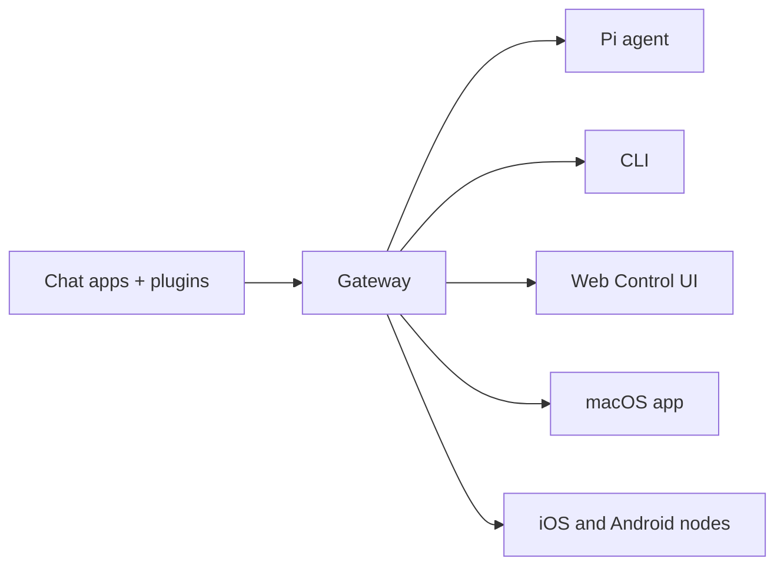

---
read_when:
    - 向新手介紹 OpenClaw
summary: OpenClaw 是可在任何作業系統上執行的 AI 代理程式多通道 Gateway。
title: OpenClaw
x-i18n:
    generated_at: "2026-05-07T13:20:07Z"
    model: gpt-5.5
    provider: openai
    source_hash: 7bf82c8551703257e55289d2b82f6436c9900a8afae7ab9b6a655332716ff37b
    source_path: index.md
    workflow: 16
---

# OpenClaw 🦞

<p align="center">
    
    
</p>

> _「去角質！去角質！」_ — 大概是某隻太空龍蝦

<p align="center">
  <strong>適用於任何作業系統的 AI agent Gateway，跨 Discord、Google Chat、iMessage、Matrix、Microsoft Teams、Signal、Slack、Telegram、WhatsApp、Zalo 等平台運作。</strong><br />
  傳送訊息，即可從口袋中取得 agent 回覆。以一個 Gateway 同時執行內建頻道、隨附頻道 Plugin、WebChat 與行動節點。
</p>

<Columns>
  <Card title="開始使用" href="/zh-TW/start/getting-started" icon="rocket">
    安裝 OpenClaw，幾分鐘內啟動 Gateway。
  </Card>
  <Card title="執行 Onboarding" href="/zh-TW/start/wizard" icon="sparkles">
    透過 `openclaw onboard` 與配對流程完成引導式設定。
  </Card>
  <Card title="開啟 Control UI" href="/zh-TW/web/control-ui" icon="layout-dashboard">
    啟動瀏覽器儀表板，用於聊天、設定與工作階段。
  </Card>
</Columns>

## 什麼是 OpenClaw？

OpenClaw 是一個**自託管 Gateway**，可將你喜愛的聊天應用程式與頻道介面，包括內建頻道以及 Discord、Google Chat、iMessage、Matrix、Microsoft Teams、Signal、Slack、Telegram、WhatsApp、Zalo 等隨附或外部頻道 Plugin，連接到 Pi 等 AI coding agent。你在自己的機器或伺服器上執行單一 Gateway 程序，它就會成為你的訊息應用程式與隨時可用 AI assistant 之間的橋樑。

**適合誰使用？** 想要一個可從任何地方傳訊息使用的個人 AI assistant，同時不放棄資料控制權，也不依賴託管服務的開發者與進階使用者。

**它有什麼不同？**

- **自託管**：在你的硬體上執行，遵循你的規則
- **多頻道**：一個 Gateway 可同時服務內建頻道以及隨附或外部頻道 Plugin
- **Agent 原生**：專為具備工具使用、工作階段、記憶體與多 agent 路由的 coding agent 打造
- **開放原始碼**：MIT 授權，由社群驅動

**你需要什麼？** Node 24（建議），或為相容性使用 Node 22 LTS (`22.16+`)、你所選供應商的 API key，以及 5 分鐘。為了最佳品質與安全性，請使用可用的最強最新世代模型。

## 運作方式



Gateway 是工作階段、路由與頻道連線的單一事實來源。

## 主要功能

<Columns>
  <Card title="多頻道 Gateway" icon="network" href="/zh-TW/channels">
    透過單一 Gateway 程序支援 Discord、iMessage、Signal、Slack、Telegram、WhatsApp、WebChat 等。
  </Card>
  <Card title="Plugin 頻道" icon="plug" href="/zh-TW/tools/plugin">
    隨附 Plugin 會在一般目前版本中加入 Matrix、Nostr、Twitch、Zalo 等支援。
  </Card>
  <Card title="多 agent 路由" icon="route" href="/zh-TW/concepts/multi-agent">
    依 agent、工作區或傳送者隔離工作階段。
  </Card>
  <Card title="媒體支援" icon="image" href="/zh-TW/nodes/images">
    傳送與接收圖片、音訊與文件。
  </Card>
  <Card title="Web Control UI" icon="monitor" href="/zh-TW/web/control-ui">
    用於聊天、設定、工作階段與節點的瀏覽器儀表板。
  </Card>
  <Card title="行動節點" icon="smartphone" href="/zh-TW/nodes">
    配對 iOS 與 Android 節點，用於 Canvas、相機與語音工作流程。
  </Card>
</Columns>

## 快速開始

<Steps>
  <Step title="安裝 OpenClaw">
    ```bash
    npm install -g openclaw@latest
    ```
  </Step>
  <Step title="Onboard 並安裝服務">
    ```bash
    openclaw onboard --install-daemon
    ```
  </Step>
  <Step title="聊天">
    在瀏覽器中開啟 Control UI 並傳送訊息：

    ```bash
    openclaw dashboard
    ```

    或連接一個頻道（[Telegram](/zh-TW/channels/telegram) 最快），從手機開始聊天。

  </Step>
</Steps>

需要完整安裝與開發設定？請參閱[開始使用](/zh-TW/start/getting-started)。

## 儀表板

Gateway 啟動後，開啟瀏覽器 Control UI。

- 本機預設：[http://127.0.0.1:18789/](http://127.0.0.1:18789/)
- 遠端存取：[網頁介面](/zh-TW/web)與 [Tailscale](/zh-TW/gateway/tailscale)

<p align="center">
  
</p>

## 設定（選用）

設定位於 `~/.openclaw/openclaw.json`。

- 如果你**什麼都不做**，OpenClaw 會使用 RPC 模式的隨附 Pi binary，並以每位傳送者各自的工作階段運作。
- 如果你想要鎖定存取，請從 `channels.whatsapp.allowFrom` 開始，群組則再加上提及規則。

範例：

```json5
{
  channels: {
    whatsapp: {
      allowFrom: ["+15555550123"],
      groups: { "*": { requireMention: true } },
    },
  },
  messages: { groupChat: { mentionPatterns: ["@openclaw"] } },
}
```

## 從這裡開始

<Columns>
  <Card title="文件中心" href="/zh-TW/start/hubs" icon="book-open">
    所有文件與指南，依使用案例整理。
  </Card>
  <Card title="設定" href="/zh-TW/gateway/configuration" icon="settings">
    核心 Gateway 設定、token 與供應商設定。
  </Card>
  <Card title="遠端存取" href="/zh-TW/gateway/remote" icon="globe">
    SSH 與 tailnet 存取模式。
  </Card>
  <Card title="頻道" href="/zh-TW/channels/telegram" icon="message-square">
    Feishu、Microsoft Teams、WhatsApp、Telegram、Discord 等頻道專屬設定。
  </Card>
  <Card title="節點" href="/zh-TW/nodes" icon="smartphone">
    具備配對、Canvas、相機與裝置動作的 iOS 與 Android 節點。
  </Card>
  <Card title="說明" href="/zh-TW/help" icon="life-buoy">
    常見修正與疑難排解入口。
  </Card>
</Columns>

## 深入了解

<Columns>
  <Card title="完整功能清單" href="/zh-TW/concepts/features" icon="list">
    完整的頻道、路由與媒體功能。
  </Card>
  <Card title="多 agent 路由" href="/zh-TW/concepts/multi-agent" icon="route">
    工作區隔離與每個 agent 的工作階段。
  </Card>
  <Card title="安全性" href="/zh-TW/gateway/security" icon="shield">
    Token、允許清單與安全控制。
  </Card>
  <Card title="疑難排解" href="/zh-TW/gateway/troubleshooting" icon="wrench">
    Gateway 診斷與常見錯誤。
  </Card>
  <Card title="關於與致謝" href="/zh-TW/reference/credits" icon="info">
    專案起源、貢獻者與授權。
  </Card>
</Columns>
