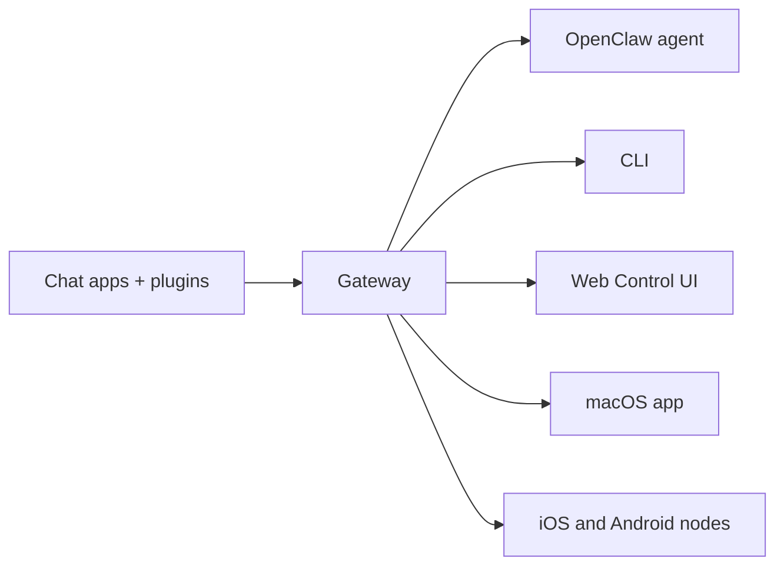

---
read_when:
    - 向新手介紹 OpenClaw
summary: OpenClaw 是可在任何作業系統上執行的 AI 代理多通道閘道。
title: OpenClaw
x-i18n:
    generated_at: "2026-07-05T11:25:28Z"
    model: gpt-5.5
    postprocess_version: locale-links-v1
    provider: openai
    source_hash: 6840275ad22e3c260c27f019264e49637562d0c095dc26ed84c110a4b12613f1
    source_path: index.md
    workflow: 16
---

# OpenClaw 🦞

<p align="center">
    
    
</p>

> _"EXFOLIATE! EXFOLIATE!"_ — 大概是某隻太空龍蝦

<p align="center">
  <strong>適用於任何作業系統的 AI 代理閘道，橫跨 Discord、Google Chat、iMessage、Matrix、Microsoft Teams、Signal、Slack、Telegram、WhatsApp、Zalo 等平台。</strong><br />
  傳送訊息，就能從口袋裡取得代理回應。透過頻道外掛、WebChat 和行動節點執行單一閘道。
</p>

<Columns>
  <Card title="開始使用" href="/zh-TW/start/getting-started" icon="rocket">
    安裝 OpenClaw，並在幾分鐘內啟動閘道。
  </Card>
  <Card title="執行入門設定" href="/zh-TW/start/wizard" icon="list-checks">
    使用 `openclaw onboard` 和配對流程進行引導式設定。
  </Card>
  <Card title="開啟控制介面" href="/zh-TW/web/control-ui" icon="layout-dashboard">
    啟動瀏覽器儀表板，用於聊天、設定和工作階段。
  </Card>
</Columns>

## OpenClaw 是什麼？

OpenClaw 是一個**自託管閘道**，可將你喜愛的聊天應用程式 — Discord、Google Chat、iMessage、Matrix、Microsoft Teams、Signal、Slack、Telegram、WhatsApp、Zalo 等，透過頻道外掛 — 連接到 AI 程式碼代理。你在自己的電腦（或伺服器）上執行單一閘道程序，它就會成為訊息應用程式與隨時可用 AI 助理之間的橋樑。

**適合誰使用？** 想要一個可從任何地方傳訊息使用的個人 AI 助理，同時不放棄資料控制權，也不依賴託管服務的開發者和進階使用者。

**它有何不同？**

- **自託管**：在你的硬體上執行，遵循你的規則
- **多頻道**：單一閘道可同時服務每個已設定的頻道外掛
- **代理原生**：專為具備工具使用、工作階段、記憶和多代理路由的程式碼代理打造
- **開放原始碼**：採用 MIT 授權，社群驅動

**你需要什麼？** 節點 24（建議），或為了相容性使用節點 22 LTS (`22.19+`)、所選供應商的 API 金鑰，以及 5 分鐘。為了最佳品質與安全性，請使用可用的最強最新一代模型。

## 運作方式



閘道是工作階段、路由和頻道連線的單一事實來源。

## 主要能力

<Columns>
  <Card title="多頻道閘道" icon="network" href="/zh-TW/channels">
    使用單一閘道程序連接 Discord、iMessage、Signal、Slack、Telegram、WhatsApp、WebChat 等。
  </Card>
  <Card title="外掛頻道" icon="plug" href="/zh-TW/tools/plugin">
    頻道外掛可加入 Matrix、Nostr、Twitch、Zalo 等；官方外掛會依需求安裝。
  </Card>
  <Card title="多代理路由" icon="route" href="/zh-TW/concepts/multi-agent">
    依代理、工作區或傳送者隔離工作階段。
  </Card>
  <Card title="媒體支援" icon="image" href="/zh-TW/nodes/images">
    傳送與接收圖片、音訊和文件。
  </Card>
  <Card title="Web 控制介面" icon="monitor" href="/zh-TW/web/control-ui">
    用於聊天、設定、工作階段和節點的瀏覽器儀表板。
  </Card>
  <Card title="行動節點" icon="smartphone" href="/zh-TW/nodes">
    配對 iOS 和 Android 節點，用於 Canvas、相機和語音啟用的工作流程。
  </Card>
</Columns>

## 快速開始

<Steps>
  <Step title="安裝 OpenClaw">
    ```bash
    npm install -g openclaw@latest
    ```
  </Step>
  <Step title="入門設定並安裝服務">
    ```bash
    openclaw onboard --install-daemon
    ```
  </Step>
  <Step title="聊天">
    在瀏覽器中開啟控制介面並傳送訊息：

    ```bash
    openclaw dashboard
    ```

    或連接一個頻道（[Telegram](/zh-TW/channels/telegram) 最快），並從手機聊天。

  </Step>
</Steps>

需要完整安裝與開發設定嗎？請參閱[開始使用](/zh-TW/start/getting-started)。

## 儀表板

閘道啟動後，開啟瀏覽器控制介面。

- 本機預設：[http://127.0.0.1:18789/](http://127.0.0.1:18789/)
- 遠端存取：[Web 介面](/zh-TW/web)和 [Tailscale](/zh-TW/gateway/tailscale)

<p align="center">
  
</p>

## 設定（選用）

設定位於 `~/.openclaw/openclaw.json`。

- 如果你**什麼都不做**，OpenClaw 會使用內建的 OpenClaw 代理執行階段；私人訊息會共用代理的主要工作階段，而每個群組聊天都會有自己的工作階段。
- 如果你想要鎖定存取，請從 `channels.whatsapp.allowFrom` 和（針對群組）提及規則開始。

範例：

```json5
{
  channels: {
    whatsapp: {
      allowFrom: ["+15555550123"],
      groups: { "*": { requireMention: true } },
    },
  },
  messages: { groupChat: { mentionPatterns: ["@openclaw"] } },
}
```

## 從這裡開始

<Columns>
  <Card title="文件中心" href="/zh-TW/start/hubs" icon="book-open">
    依使用案例整理的所有文件與指南。
  </Card>
  <Card title="設定" href="/zh-TW/gateway/configuration" icon="settings">
    核心閘道設定、權杖和供應商設定。
  </Card>
  <Card title="遠端存取" href="/zh-TW/gateway/remote" icon="globe">
    SSH 和 tailnet 存取模式。
  </Card>
  <Card title="頻道" href="/zh-TW/channels/telegram" icon="message-square">
    Discord、Feishu、Microsoft Teams、Telegram、WhatsApp 等的頻道專屬設定。
  </Card>
  <Card title="節點" href="/zh-TW/nodes" icon="smartphone">
    具備配對、Canvas、相機和裝置動作的 iOS 與 Android 節點。
  </Card>
  <Card title="說明" href="/zh-TW/help" icon="life-buoy">
    常見修正與疑難排解入口點。
  </Card>
</Columns>

## 了解更多

<Columns>
  <Card title="完整功能清單" href="/zh-TW/concepts/features" icon="list">
    完整的頻道、路由和媒體能力。
  </Card>
  <Card title="多代理路由" href="/zh-TW/concepts/multi-agent" icon="route">
    工作區隔離與個別代理工作階段。
  </Card>
  <Card title="安全性" href="/zh-TW/gateway/security" icon="shield">
    權杖、允許清單和安全控制。
  </Card>
  <Card title="疑難排解" href="/zh-TW/gateway/troubleshooting" icon="wrench">
    閘道診斷與常見錯誤。
  </Card>
  <Card title="關於與致謝" href="/zh-TW/reference/credits" icon="info">
    專案起源、貢獻者和授權。
  </Card>
</Columns>
