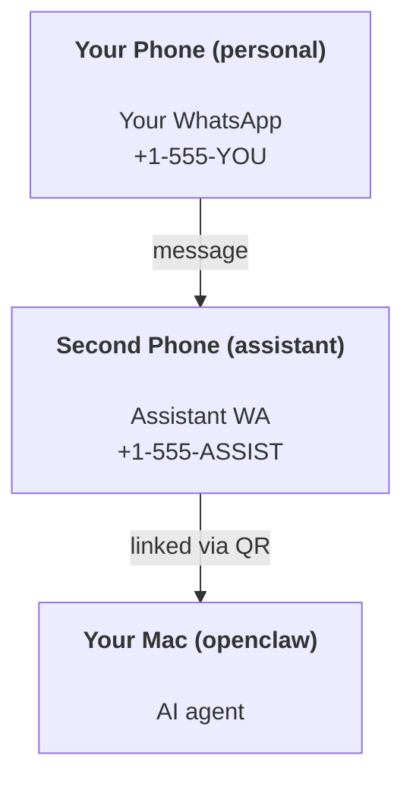

---
read_when:
    - 新助理執行個體的初始設定
    - 審查安全性／權限影響
summary: 以個人助理形式執行 OpenClaw 的端對端指南，並附安全注意事項
title: 個人助理設定
x-i18n:
    generated_at: "2026-05-11T20:35:38Z"
    model: gpt-5.5
    provider: openai
    source_hash: 74dd13c4b43faa8e29e1fd56a355f36c6cf7c3fa8193bb62c1056211933f4df9
    source_path: start/openclaw.md
    workflow: 16
---

OpenClaw 是一個自託管 Gateway，可將 Discord、Google Chat、iMessage、Matrix、Microsoft Teams、Signal、Slack、Telegram、WhatsApp、Zalo 等連接到 AI 代理。本指南涵蓋「個人助理」設定：一個專用的 WhatsApp 號碼，會像你隨時在線的 AI 助理一樣運作。

## ⚠️ 安全第一

你正把代理放在可以執行下列操作的位置：

- 在你的機器上執行命令（視你的工具政策而定）
- 讀寫工作區中的檔案
- 透過 WhatsApp/Telegram/Discord/Mattermost 和其他內建通道傳送訊息

請從保守設定開始：

- 一律設定 `channels.whatsapp.allowFrom`（絕不要在你的個人 Mac 上以對全世界開放的方式執行）。
- 為助理使用專用的 WhatsApp 號碼。
- Heartbeats 現在預設每 30 分鐘執行一次。在你信任此設定前，請先透過設定 `agents.defaults.heartbeat.every: "0m"` 停用。

## 先決條件

- 已安裝並完成 OpenClaw onboarding；如果尚未完成，請參閱[快速入門](/zh-TW/start/getting-started)
- 給助理使用的第二個電話號碼（SIM/eSIM/預付卡）

## 雙手機設定（建議）

你需要的是這樣：



如果你把個人的 WhatsApp 連結到 OpenClaw，傳給你的每則訊息都會變成「代理輸入」。這通常不是你想要的。

## 5 分鐘快速開始

1. 配對 WhatsApp Web（會顯示 QR；用助理手機掃描）：

```bash
openclaw channels login
```

2. 啟動 Gateway（保持執行）：

```bash
openclaw gateway --port 18789
```

3. 將最小設定放入 `~/.openclaw/openclaw.json`：

```json5
{
  gateway: { mode: "local" },
  channels: { whatsapp: { allowFrom: ["+15555550123"] } },
}
```

現在從允許清單中的手機傳訊息給助理號碼。

onboarding 完成後，OpenClaw 會自動開啟儀表板，並列印一個乾淨的（非權杖化）連結。如果儀表板要求驗證，請將已設定的共享密鑰貼到 Control UI 設定中。onboarding 預設使用權杖（`gateway.auth.token`），但如果你已將 `gateway.auth.mode` 切換為 `password`，密碼驗證也可使用。之後若要重新開啟：`openclaw dashboard`。

## 給代理一個工作區（AGENTS）

OpenClaw 會從其工作區目錄讀取操作指示和「記憶」。

預設情況下，OpenClaw 使用 `~/.openclaw/workspace` 作為代理工作區，並會在設定/第一次代理執行時自動建立它（以及初始的 `AGENTS.md`、`SOUL.md`、`TOOLS.md`、`IDENTITY.md`、`USER.md`、`HEARTBEAT.md`）。`BOOTSTRAP.md` 只會在工作區全新時建立（你刪除它之後不應該再出現）。`MEMORY.md` 是選用的（不會自動建立）；存在時會在一般工作階段載入。子代理工作階段只會注入 `AGENTS.md` 和 `TOOLS.md`。

<Tip>
把這個資料夾視為 OpenClaw 的記憶，並將它做成 git repo（理想情況下為私有），如此你的 `AGENTS.md` 和記憶檔案就會有備份。如果已安裝 git，全新的工作區會自動初始化。
</Tip>

```bash
openclaw setup
```

完整工作區配置與備份指南：[代理工作區](/zh-TW/concepts/agent-workspace)
記憶工作流程：[記憶](/zh-TW/concepts/memory)

選用：使用 `agents.defaults.workspace` 選擇不同的工作區（支援 `~`）。

```json5
{
  agents: {
    defaults: {
      workspace: "~/.openclaw/workspace",
    },
  },
}
```

如果你已經從 repo 發布自己的工作區檔案，可以完全停用 bootstrap 檔案建立：

```json5
{
  agents: {
    defaults: {
      skipBootstrap: true,
    },
  },
}
```

## 將它變成「助理」的設定

OpenClaw 預設已有良好的助理設定，但你通常會想調整：

- [`SOUL.md`](/zh-TW/concepts/soul) 中的人格/指示
- 思考預設值（如有需要）
- heartbeats（當你信任它之後）

範例：

```json5
{
  logging: { level: "info" },
  agents: {
    defaults: {
      model: { primary: "anthropic/claude-opus-4-6" },
      workspace: "~/.openclaw/workspace",
      thinkingDefault: "high",
      timeoutSeconds: 1800,
      // Start with 0; enable later.
      heartbeat: { every: "0m" },
    },
    list: [
      {
        id: "main",
        default: true,
        groupChat: {
          mentionPatterns: ["@openclaw", "openclaw"],
        },
      },
    ],
  },
  channels: {
    whatsapp: {
      allowFrom: ["+15555550123"],
      groups: {
        "*": { requireMention: true },
      },
    },
  },
  session: {
    scope: "per-sender",
    resetTriggers: ["/new", "/reset"],
    reset: {
      mode: "daily",
      atHour: 4,
      idleMinutes: 10080,
    },
  },
}
```

## 工作階段與記憶

- 工作階段檔案：`~/.openclaw/agents/<agentId>/sessions/{{SessionId}}.jsonl`
- 工作階段中繼資料（權杖用量、最後路由等）：`~/.openclaw/agents/<agentId>/sessions/sessions.json`（舊版：`~/.openclaw/sessions/sessions.json`）
- `/new` 或 `/reset` 會為該聊天開始新的工作階段（可透過 `resetTriggers` 設定）。如果單獨傳送，OpenClaw 會確認重設，而不會呼叫模型。
- `/compact [instructions]` 會壓縮工作階段脈絡，並回報剩餘的脈絡預算。

## Heartbeats（主動模式）

預設情況下，OpenClaw 每 30 分鐘執行一次 Heartbeat，提示為：
`Read HEARTBEAT.md if it exists (workspace context). Follow it strictly. Do not infer or repeat old tasks from prior chats. If nothing needs attention, reply HEARTBEAT_OK.`
設定 `agents.defaults.heartbeat.every: "0m"` 可停用。

- 如果 `HEARTBEAT.md` 存在但實際上是空的（只有空白行和像 `# Heading` 這類 markdown 標題），OpenClaw 會略過 heartbeat 執行以節省 API 呼叫。
- 如果檔案不存在，heartbeat 仍會執行，並由模型決定要做什麼。
- 如果代理回覆 `HEARTBEAT_OK`（可選擇加上短填充；請參閱 `agents.defaults.heartbeat.ackMaxChars`），OpenClaw 會抑制該 heartbeat 的對外傳遞。
- 預設允許將 heartbeat 傳遞到 DM 樣式的 `user:<id>` 目標。設定 `agents.defaults.heartbeat.directPolicy: "block"` 可抑制直接目標傳遞，同時保持 heartbeat 執行啟用。
- Heartbeats 會執行完整的代理回合；較短的間隔會消耗更多權杖。

```json5
{
  agents: {
    defaults: {
      heartbeat: { every: "30m" },
    },
  },
}
```

## 媒體輸入與輸出

傳入附件（圖片/音訊/文件）可透過樣板提供給你的命令：

- `{{MediaPath}}`（本機暫存檔案路徑）
- `{{MediaUrl}}`（偽 URL）
- `{{Transcript}}`（如果已啟用音訊轉錄）

來自代理的傳出附件：在獨立一行加入 `MEDIA:<path-or-url>`（無空格）。範例：

```
Here's the screenshot.
MEDIA:https://example.com/screenshot.png
```

OpenClaw 會擷取這些內容，並將它們作為媒體與文字一起傳送。

本機路徑行為遵循與代理相同的檔案讀取信任模型：

- 如果 `tools.fs.workspaceOnly` 為 `true`，傳出的 `MEDIA:` 本機路徑仍會限制在 OpenClaw 暫存根目錄、媒體快取、代理工作區路徑，以及沙盒產生的檔案。
- 如果 `tools.fs.workspaceOnly` 為 `false`，傳出的 `MEDIA:` 可以使用代理已被允許讀取的主機本機檔案。
- 本機路徑可以是絕對路徑、相對於工作區的路徑，或使用 `~/` 的相對於家目錄路徑。
- 主機本機傳送仍只允許媒體和安全文件類型（圖片、音訊、影片、PDF 和 Office 文件）。純文字和類似秘密的檔案不會被視為可傳送媒體。

這表示，當你的檔案系統政策已允許讀取時，工作區外產生的圖片/檔案現在也可以傳送，而不會重新開放任意主機文字附件外洩。

## 操作檢查清單

```bash
openclaw status          # local status (creds, sessions, queued events)
openclaw status --all    # full diagnosis (read-only, pasteable)
openclaw status --deep   # asks the gateway for a live health probe with channel probes when supported
openclaw health --json   # gateway health snapshot (WS; default can return a fresh cached snapshot)
```

記錄位於 `/tmp/openclaw/` 下（預設：`openclaw-YYYY-MM-DD.log`）。

## 後續步驟

- WebChat：[WebChat](/zh-TW/web/webchat)
- Gateway 操作：[Gateway runbook](/zh-TW/gateway)
- Cron + 喚醒：[Cron 工作](/zh-TW/automation/cron-jobs)
- macOS 選單列伴侶應用程式：[OpenClaw macOS 應用程式](/zh-TW/platforms/macos)
- iOS 節點應用程式：[iOS 應用程式](/zh-TW/platforms/ios)
- Android 節點應用程式：[Android 應用程式](/zh-TW/platforms/android)
- Windows 狀態：[Windows (WSL2)](/zh-TW/platforms/windows)
- Linux 狀態：[Linux 應用程式](/zh-TW/platforms/linux)
- 安全性：[安全性](/zh-TW/gateway/security)

## 相關

- [快速入門](/zh-TW/start/getting-started)
- [設定](/zh-TW/start/setup)
- [通道概觀](/zh-TW/channels)
