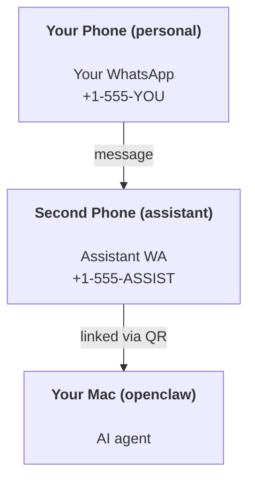

---
read_when:
    - 啟用新的助理執行個體
    - 審查安全性／權限影響
summary: 端對端指南：以安全注意事項將 OpenClaw 作為個人助理執行
title: 個人助理設定
x-i18n:
    generated_at: "2026-07-05T11:43:58Z"
    model: gpt-5.5
    postprocess_version: locale-links-v1
    provider: openai
    source_hash: 57c515fa414d579850e008aaa60ddb5243a1237b205be111187907dd905be9cb
    source_path: start/openclaw.md
    workflow: 16
---

OpenClaw 是一個自託管閘道，可將 Discord、Google Chat、iMessage、Matrix、Microsoft Teams、Signal、Slack、Telegram、WhatsApp、Zalo 等連接到 AI 代理。本指南涵蓋「個人助理」設定：一個專用的 WhatsApp 號碼，行為就像你隨時待命的 AI 助理。

## 安全優先

把頻道交給代理，代表它可能可以在你的機器上執行命令（取決於你的工具政策）、讀寫工作區中的檔案，並透過任何已連接的頻道傳送訊息。請先採取保守做法：

- 一律設定 `channels.whatsapp.allowFrom`（絕不要在你的個人 Mac 上開放給全世界使用）。
- 為助理使用專用的 WhatsApp 號碼。
- 心跳偵測預設每 30 分鐘執行一次。在你信任此設定之前，請設定 `agents.defaults.heartbeat.every: "0m"` 將其停用。

## 先決條件

- 已安裝並完成初始設定的 OpenClaw - 如果你還沒完成，請參閱[開始使用](/zh-TW/start/getting-started)
- 給助理使用的第二個電話號碼（SIM/eSIM/預付卡）

## 雙手機設定（建議）

你想要的是這樣：



如果你把個人 WhatsApp 連結到 OpenClaw，傳給你的每則訊息都會變成 `agent input`。這通常不是你想要的。

## 5 分鐘快速開始

1. 配對 WhatsApp Web（顯示 QR；用助理手機掃描）：

```bash
openclaw channels login
```

2. 啟動閘道（保持執行）：

```bash
openclaw gateway --port 18789
```

3. 在 `~/.openclaw/openclaw.json` 放入最小設定：

```json5
{
  gateway: { mode: "local" },
  channels: { whatsapp: { allowFrom: ["+15555550123"] } },
}
```

現在從允許清單中的手機傳訊息給助理號碼。

初始設定完成時，OpenClaw 會自動開啟儀表板，並印出一個乾淨的（非權杖化）連結。如果儀表板提示需要驗證，請將已設定的共用密鑰貼到 Control UI 設定中。初始設定預設使用權杖（`gateway.auth.token`），但如果你已將 `gateway.auth.mode` 切換為 `password`，也可以使用密碼驗證。稍後若要重新開啟：`openclaw dashboard`。

## 給代理一個工作區（AGENTS）

OpenClaw 會從其工作區目錄讀取操作指示與「記憶」。

預設情況下，OpenClaw 使用 `~/.openclaw/workspace` 作為代理工作區，並在初始設定或第一次代理執行時自動建立它（加上起始用的 `AGENTS.md`、`SOUL.md`、`TOOLS.md`、`IDENTITY.md`、`USER.md`、`HEARTBEAT.md`）。`BOOTSTRAP.md` 只會為全新的工作區建立，刪除後不應再出現。`MEMORY.md` 是選用的，且永遠不會自動建立；若存在，會在一般工作階段載入。子代理工作階段只會注入 `AGENTS.md` 和 `TOOLS.md`。

<Tip>
把這個資料夾視為 OpenClaw 的記憶，並把它做成 git repo（最好是私有），如此你的 `AGENTS.md` 與記憶檔案就會有備份。如果已安裝 git，全新的工作區會自動以 `git init` 初始化。
</Tip>

若要建立工作區與設定資料夾，而不執行完整的初始設定精靈：

```bash
openclaw setup --baseline
```

（單獨執行 `openclaw setup` 是 `openclaw onboard` 的別名，會執行完整的互動式精靈。）

完整工作區配置與備份指南：[代理工作區](/zh-TW/concepts/agent-workspace)
記憶工作流程：[記憶](/zh-TW/concepts/memory)

選用：使用 `agents.defaults.workspace` 選擇不同的工作區（支援 `~`）。

```json5
{
  agents: {
    defaults: {
      workspace: "~/.openclaw/workspace",
    },
  },
}
```

如果你已經從 repo 提供自己的工作區檔案，可以完全停用 bootstrap 檔案建立：

```json5
{
  agents: {
    defaults: {
      skipBootstrap: true,
    },
  },
}
```

## 讓它變成「助理」的設定

OpenClaw 預設就是不錯的助理設定，但你通常會想調整：

- [`SOUL.md`](/zh-TW/concepts/soul) 中的人格/指示
- 思考預設值（如有需要）
- 心跳偵測（在你信任它之後）

範例：

```json5
{
  logging: { level: "info" },
  agents: {
    defaults: {
      model: { primary: "anthropic/claude-opus-4-8" },
      workspace: "~/.openclaw/workspace",
      thinkingDefault: "high",
      timeoutSeconds: 1800,
      // Start with 0; enable later.
      heartbeat: { every: "0m" },
    },
    list: [
      {
        id: "main",
        default: true,
        groupChat: {
          mentionPatterns: ["@openclaw", "openclaw"],
        },
      },
    ],
  },
  channels: {
    whatsapp: {
      allowFrom: ["+15555550123"],
      groups: {
        "*": { requireMention: true },
      },
    },
  },
  session: {
    scope: "per-sender",
    resetTriggers: ["/new", "/reset"],
    reset: {
      mode: "daily",
      atHour: 4,
      idleMinutes: 10080,
    },
  },
}
```

## 工作階段與記憶

- 工作階段檔案：`~/.openclaw/agents/<agentId>/sessions/{{SessionId}}.jsonl`
- 工作階段中繼資料（權杖用量、最後路由等）：`~/.openclaw/agents/<agentId>/sessions/sessions.json`
- `/new` 或 `/reset` 會為該聊天開始全新的工作階段（可透過 `session.resetTriggers` 設定）。如果單獨傳送，OpenClaw 會確認重設，而不叫用模型。
- `/compact [instructions]` 會壓縮工作階段脈絡，並回報剩餘的脈絡預算。

## 心跳偵測（主動模式）

預設情況下，OpenClaw 每 30 分鐘執行一次心跳偵測，使用的提示為：
`Read HEARTBEAT.md if it exists (workspace context). Follow it strictly. Do not infer or repeat old tasks from prior chats. If nothing needs attention, reply HEARTBEAT_OK.`
設定 `agents.defaults.heartbeat.every: "0m"` 可停用。

- 如果 `HEARTBEAT.md` 存在但實際上是空的（只有空白行、Markdown/HTML 註解、像 `# Heading` 這樣的 Markdown 標題、圍欄標記，或空的待辦清單 stub），OpenClaw 會略過心跳偵測執行以節省 API 呼叫。
- 如果檔案不存在，心跳偵測仍會執行，並由模型決定要做什麼。
- 如果代理回覆 `HEARTBEAT_OK`（可選擇附加短填充；請參閱 `agents.defaults.heartbeat.ackMaxChars`），OpenClaw 會抑制該次心跳偵測的外送傳遞。
- 預設允許將心跳偵測傳遞到 DM 樣式的 `user:<id>` 目標。設定 `agents.defaults.heartbeat.directPolicy: "block"` 可在保持心跳偵測執行啟用的同時，抑制直接目標傳遞。
- 心跳偵測會執行完整的代理回合 - 較短的間隔會消耗更多權杖。

```json5
{
  agents: {
    defaults: {
      heartbeat: { every: "30m" },
    },
  },
}
```

## 媒體輸入與輸出

傳入附件（圖片/音訊/文件）可以透過範本提供給你的命令：

- `{{MediaPath}}`（本機暫存檔案路徑）
- `{{MediaUrl}}`（偽 URL）
- `{{Transcript}}`（如果已啟用音訊轉錄）

代理送出的附件會使用訊息工具或回覆 payload 上的結構化媒體欄位，例如 `media`、`mediaUrl`、`mediaUrls`、`path` 或 `filePath`。訊息工具引數範例：

```json
{
  "message": "Here's the screenshot.",
  "mediaUrl": "https://example.com/screenshot.png"
}
```

OpenClaw 會將結構化媒體與文字一併傳送。舊版最終助理回覆仍可能為了相容性而被正規化，但工具輸出、瀏覽器輸出、串流區塊與訊息動作不會把文字剖析為附件命令。

本機路徑行為遵循與代理相同的檔案讀取信任模型：

- 如果 `tools.fs.workspaceOnly` 為 `true`，送出的本機媒體路徑會限制在 OpenClaw 暫存根目錄、媒體快取、代理工作區路徑，以及沙箱產生的檔案。
- 如果 `tools.fs.workspaceOnly` 為 `false`，送出的本機媒體可以使用代理已被允許讀取的主機本機檔案。
- 本機路徑可以是絕對路徑、工作區相對路徑，或使用 `~/` 的家目錄相對路徑。
- 主機本機傳送仍只允許媒體與安全文件類型（圖片、音訊、影片、PDF、Office 文件，以及經驗證的文字文件，例如 Markdown/MD、TXT、JSON、YAML 與 YML）。這是現有主機讀取信任邊界的延伸，而不是祕密掃描器：如果代理可以讀取主機本機的 `secret.txt` 或 `config.json`，當副檔名與內容驗證相符時，它就可以附加該檔案。

請將敏感檔案放在代理可讀檔案系統之外，或保持 `tools.fs.workspaceOnly: true` 以取得更嚴格的本機路徑傳送限制。

## 維運檢查清單

```bash
openclaw status          # local status (creds, sessions, queued events)
openclaw status --all    # full diagnosis (read-only, pasteable)
openclaw status --deep   # probe channels (WhatsApp Web + Telegram + Discord + Slack + Signal)
openclaw health --json   # gateway health snapshot over the WS connection
```

日誌位於 `/tmp/openclaw/` 底下（預設：`openclaw-YYYY-MM-DD.log`）。

## 下一步

- WebChat：[WebChat](/zh-TW/web/webchat)
- 閘道維運：[閘道 runbook](/zh-TW/gateway)
- 排程 + 喚醒：[排程作業](/zh-TW/automation/cron-jobs)
- macOS 選單列輔助程式：[OpenClaw macOS app](/zh-TW/platforms/macos)
- iOS 節點應用程式：[iOS app](/zh-TW/platforms/ios)
- Android 節點應用程式：[Android app](/zh-TW/platforms/android)
- Windows 中樞：[Windows](/zh-TW/platforms/windows)
- Linux 狀態：[Linux app](/zh-TW/platforms/linux)
- 安全性：[安全性](/zh-TW/gateway/security)

## 相關

- [開始使用](/zh-TW/start/getting-started)
- [設定](/zh-TW/start/setup)
- [頻道概覽](/zh-TW/channels)
