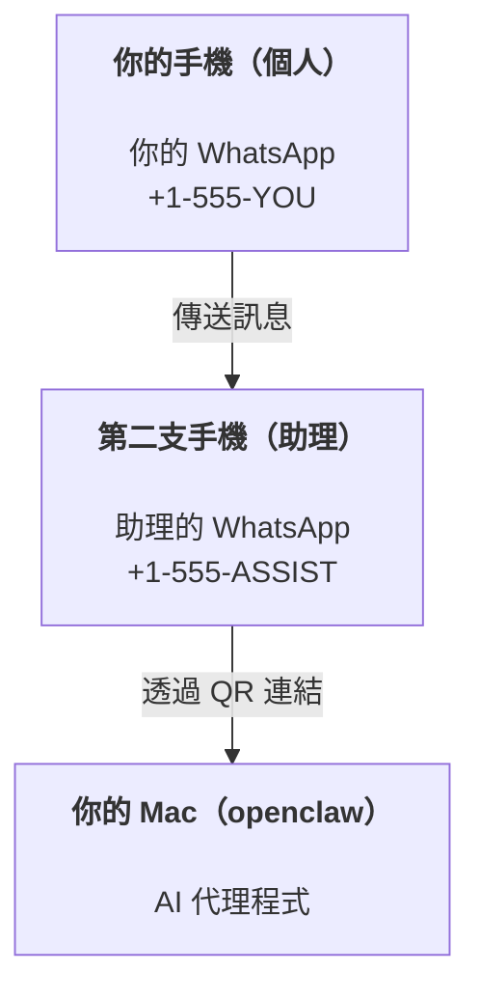

---
read_when:
    - 新助理執行個體的初始設定
    - 檢視安全性／權限方面的影響
summary: 以 OpenClaw 作為個人助理的端對端操作指南與安全注意事項
title: 個人助理設定
x-i18n:
    generated_at: "2026-07-12T14:51:17Z"
    model: gpt-5.6
    postprocess_version: locale-links-v1
    prompt_version: 15
    provider: openai
    source_hash: e8c34e31314f55647059fd600935330110add27b338a675bc0ce1529bebb207d
    source_path: start/openclaw.md
    workflow: 16
---

OpenClaw 是一個自託管閘道，可將 Discord、Google Chat、iMessage、Matrix、Microsoft Teams、Signal、Slack、Telegram、WhatsApp、Zalo 等服務連接至 AI 代理程式。本指南說明「個人助理」設定：使用一個專用的 WhatsApp 號碼，作為隨時待命的 AI 助理。

## 安全第一

將頻道提供給代理程式後，代理程式便可能在你的機器上執行命令（取決於你的工具政策）、讀取及寫入工作區中的檔案，並透過任何已連接的頻道向外傳送訊息。初期請採取保守設定：

- 一律設定 `channels.whatsapp.allowFrom`（切勿在你的個人 Mac 上開放給所有人使用）。
- 為助理使用專用的 WhatsApp 號碼。
- 心跳偵測預設每 30 分鐘執行一次。在你信任此設定之前，請將 `agents.defaults.heartbeat.every: "0m"` 設為停用。

## 先決條件

- 已安裝 OpenClaw 並完成初始設定；如果尚未完成，請參閱[開始使用](/zh-TW/start/getting-started)
- 為助理準備第二個電話號碼（SIM/eSIM/預付卡）

## 雙手機設定（建議）

你需要的是：



如果你將個人 WhatsApp 連結至 OpenClaw，傳給你的每則訊息都會成為「代理程式輸入」。這通常不是你想要的結果。

## 5 分鐘快速開始

1. 配對 WhatsApp Web（畫面會顯示 QR 碼；使用助理手機掃描）：

```bash
openclaw channels login
```

2. 啟動閘道（保持執行）：

```bash
openclaw gateway --port 18789
```

3. 在 `~/.openclaw/openclaw.json` 中加入最基本的設定：

```json5
{
  gateway: { mode: "local" },
  channels: { whatsapp: { allowFrom: ["+15555550123"] } },
}
```

現在，請從允許清單中的手機傳送訊息至助理號碼。

初始設定完成後，OpenClaw 會自動開啟儀表板，並顯示一個簡潔（不含權杖）的連結。如果儀表板提示需要驗證，請將設定的共用密鑰貼到 Control UI 設定中。初始設定預設使用權杖（`gateway.auth.token`），但如果你已將 `gateway.auth.mode` 切換為 `password`，也可以使用密碼驗證。若要稍後重新開啟，請執行：`openclaw dashboard`。

## 為代理程式提供工作區（AGENTS）

OpenClaw 會從其工作區目錄讀取操作指示和「記憶」。

OpenClaw 預設使用 `~/.openclaw/workspace` 作為代理程式工作區，並在初始設定或首次執行代理程式時自動建立此目錄（以及初始的 `AGENTS.md`、`SOUL.md`、`TOOLS.md`、`IDENTITY.md`、`USER.md`、`HEARTBEAT.md`）。`BOOTSTRAP.md` 只會為全新的工作區建立，刪除後不應再次出現。`MEMORY.md` 是選用檔案，且絕不會自動建立；若存在，便會在一般工作階段中載入。子代理程式工作階段只會注入 `AGENTS.md` 和 `TOOLS.md`。

<Tip>
請將此資料夾視為 OpenClaw 的記憶，並將其設為 git 儲存庫（最好是私人儲存庫），以便備份你的 `AGENTS.md` 和記憶檔案。如果已安裝 git，全新的工作區會自動使用 `git init` 初始化。
</Tip>

若要建立工作區與設定資料夾，而不執行完整的初始設定精靈：

```bash
openclaw setup --baseline
```

（單獨執行 `openclaw setup` 是 `openclaw onboard` 的別名，會執行完整的互動式精靈。）

完整工作區配置與備份指南：[代理程式工作區](/zh-TW/concepts/agent-workspace)
記憶工作流程：[記憶](/zh-TW/concepts/memory)

選用：透過 `agents.defaults.workspace` 選擇其他工作區（支援 `~`）。

```json5
{
  agents: {
    defaults: {
      workspace: "~/.openclaw/workspace",
    },
  },
}
```

如果你已經從儲存庫提供自己的工作區檔案，可以完全停用啟動檔案建立功能：

```json5
{
  agents: {
    defaults: {
      skipBootstrap: true,
    },
  },
}
```

## 將它變成「助理」的設定

OpenClaw 預設提供良好的助理設定，但你通常會想要調整：

- [`SOUL.md`](/zh-TW/concepts/soul) 中的角色設定／指示
- 思考預設值（如有需要）
- 心跳偵測（在你信任它之後）

範例：

```json5
{
  logging: { level: "info" },
  agents: {
    defaults: {
      model: { primary: "anthropic/claude-opus-4-8" },
      workspace: "~/.openclaw/workspace",
      thinkingDefault: "high",
      timeoutSeconds: 1800,
      // 從 0 開始；稍後再啟用。
      heartbeat: { every: "0m" },
    },
    list: [
      {
        id: "main",
        default: true,
        groupChat: {
          mentionPatterns: ["@openclaw", "openclaw"],
        },
      },
    ],
  },
  channels: {
    whatsapp: {
      allowFrom: ["+15555550123"],
      groups: {
        "*": { requireMention: true },
      },
    },
  },
  session: {
    scope: "per-sender",
    resetTriggers: ["/new", "/reset"],
    reset: {
      mode: "daily",
      atHour: 4,
      idleMinutes: 10080,
    },
  },
}
```

## 工作階段與記憶

- 工作階段資料列、逐字稿資料列與中繼資料（權杖用量、上一個路由等）：`~/.openclaw/agents/<agentId>/agent/openclaw-agent.sqlite`
- 舊版／封存的逐字稿成品：`~/.openclaw/agents/<agentId>/sessions/`
- 舊版資料列遷移來源：`~/.openclaw/agents/<agentId>/sessions/sessions.json`
- `/new` 或 `/reset` 會為該聊天啟動新的工作階段（可透過 `session.resetTriggers` 設定）。如果單獨傳送，OpenClaw 會確認重設，而不叫用模型。
- `/compact [instructions]` 會壓縮工作階段內容，並回報剩餘的內容預算。

## 心跳偵測（主動模式）

OpenClaw 預設會每 30 分鐘執行一次心跳偵測，並使用以下提示：
`Read HEARTBEAT.md if it exists (workspace context). Follow it strictly. Do not infer or repeat old tasks from prior chats. If nothing needs attention, reply HEARTBEAT_OK.`
設定 `agents.defaults.heartbeat.every: "0m"` 即可停用。

- 如果 `HEARTBEAT.md` 存在但實際上是空的（僅包含空白行、Markdown/HTML 註解、如 `# Heading` 的 Markdown 標題、程式碼圍欄標記或空白檢查清單項目），OpenClaw 會略過該次心跳偵測執行，以節省 API 呼叫次數。
- 如果檔案不存在，心跳偵測仍會執行，並由模型決定該做什麼。
- 如果代理程式回覆 `HEARTBEAT_OK`（可選擇加上簡短的補充文字；請參閱 `agents.defaults.heartbeat.ackMaxChars`），OpenClaw 會抑制該次心跳偵測的對外傳送。
- 預設允許將心跳偵測傳送至私訊形式的 `user:<id>` 目標。設定 `agents.defaults.heartbeat.directPolicy: "block"` 可抑制傳送至直接目標，同時維持心跳偵測執行。
- 心跳偵測會執行完整的代理程式回合——間隔越短，消耗的權杖越多。

```json5
{
  agents: {
    defaults: {
      heartbeat: { every: "30m" },
    },
  },
}
```

## 媒體輸入與輸出

輸入附件（圖片／音訊／文件）可透過範本提供給你的命令：

- `{{MediaPath}}`（本機暫存檔案路徑）
- `{{MediaUrl}}`（虛擬 URL）
- `{{Transcript}}`（若已啟用音訊轉錄）

代理程式的輸出附件會使用訊息工具或回覆承載內容中的結構化媒體欄位，例如 `media`、`mediaUrl`、`mediaUrls`、`path` 或 `filePath`。訊息工具引數範例：

```json
{
  "message": "這是螢幕截圖。",
  "mediaUrl": "https://example.com/screenshot.png"
}
```

OpenClaw 會將結構化媒體與文字一併傳送。為了相容性，舊版的最終助理回覆可能仍會經過正規化，但工具輸出、瀏覽器輸出、串流區塊和訊息動作不會將文字解析為附件命令。

本機路徑行為遵循與代理程式相同的檔案讀取信任模型：

- 如果 `tools.fs.workspaceOnly` 為 `true`，輸出的本機媒體路徑仍僅限於 OpenClaw 暫存根目錄、媒體快取、代理程式工作區路徑，以及沙箱產生的檔案。
- 如果 `tools.fs.workspaceOnly` 為 `false`，輸出的本機媒體可以使用代理程式已獲准讀取的主機本機檔案。
- 本機路徑可以是絕對路徑、工作區相對路徑，或使用 `~/` 的家目錄相對路徑。
- 從主機本機傳送時，仍只允許媒體和安全的文件類型（圖片、音訊、影片、PDF、Office 文件，以及經驗證的文字文件，例如 Markdown/MD、TXT、JSON、YAML 和 YML）。這是現有主機讀取信任邊界的延伸，而非機密掃描器：如果代理程式可以讀取主機本機的 `secret.txt` 或 `config.json`，當副檔名和內容驗證相符時，它就能附加該檔案。

請將敏感檔案存放在代理程式可讀取的檔案系統之外，或維持 `tools.fs.workspaceOnly: true`，以更嚴格地限制本機路徑傳送。

## 操作檢查清單

```bash
openclaw status          # 本機狀態（認證資訊、工作階段、已排入佇列的事件）
openclaw status --all    # 完整診斷（唯讀、可貼上）
openclaw status --deep   # 探測頻道（WhatsApp Web + Telegram + Discord + Slack + Signal）
openclaw health --json   # 透過 WS 連線取得閘道健康狀態快照
```

記錄檔位於 `/tmp/openclaw/` 下（預設：`openclaw-YYYY-MM-DD.log`）。

## 後續步驟

- WebChat：[WebChat](/zh-TW/web/webchat)
- 閘道操作：[閘道操作手冊](/zh-TW/gateway)
- 排程與喚醒：[排程工作](/zh-TW/automation/cron-jobs)
- macOS 選單列輔助程式：[OpenClaw macOS 應用程式](/zh-TW/platforms/macos)
- iOS 節點應用程式：[iOS 應用程式](/zh-TW/platforms/ios)
- Android 節點應用程式：[Android 應用程式](/zh-TW/platforms/android)
- Windows 中樞：[Windows](/zh-TW/platforms/windows)
- Linux 狀態：[Linux 應用程式](/zh-TW/platforms/linux)
- 安全性：[安全性](/zh-TW/gateway/security)

## 相關內容

- [開始使用](/zh-TW/start/getting-started)
- [設定](/zh-TW/start/setup)
- [頻道概覽](/zh-TW/channels)
